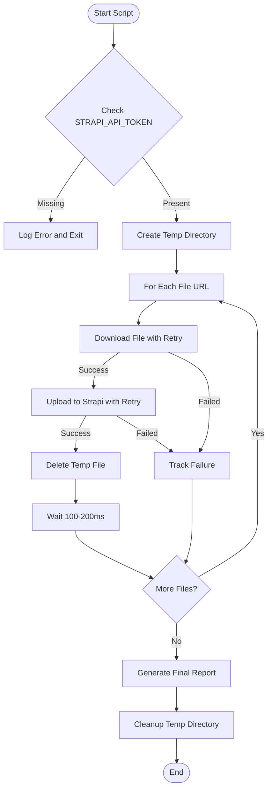

# Audio Files Migration Script Implementation

## Overview

This plan implements a migration script to download 87 audio files from m10z.picnotes.de and upload them to Strapi CMS at `https://cms.m10z.de/api/upload`. The script includes retry logic, error handling, progress tracking, and proper cleanup.

## Implementation Details

### Task 1: Dependencies and Environment Configuration

**Files to modify:**

- `backend/package.json` - Add dependencies and npm script
- `backend/README.md` - Document environment variable

**Changes:**

1. Add `formdata-node` to `dependencies` section
2. Add `tsx` to `devDependencies` section  
3. Add `STRAPI_API_TOKEN` documentation to README.md with usage instructions

**Note:** The script will read `STRAPI_API_TOKEN` from `process.env` directly (Node.js standard), not using Strapi's `env()` helper since this is a standalone script, not a Strapi config file.

### Task 2: Core Migration Script

**New file:** `backend/src/scripts/migrate-audio-files.ts`**Script structure:**

- TypeScript interfaces for file processing status tracking
- Hardcoded array of 87 file URLs (placeholder to be filled)
- Sequential processing with delays (100-200ms between requests)
- Retry logic with exponential backoff (3 attempts)
- Temporary file management with cleanup
- Progress logging and final migration report

**Key implementation details:**

1. **File Download:**

- Use Node.js built-in `fetch` API
- Create temporary directory with `fs.mkdtemp()` using `os.tmpdir()`
- Extract filename from URL using `URL` constructor and `path.basename()`
- Preserve file extension
- Retry logic: 3 attempts with exponential backoff (1s, 2s, 4s delays)

2. **Strapi Upload:**

- Use `formdata-node` to construct FormData
- POST to `https://cms.m10z.de/api/upload`
- Bearer token authentication: `Authorization: Bearer ${process.env.STRAPI_API_TOKEN}`
- Content-Type header: `multipart/form-data` (set automatically by FormData)
- Retry logic: 3 attempts with exponential backoff
- Handle Strapi response (returns array of uploaded files)

3. **Error Handling:**

- Track failed files with error messages
- Use try-catch-finally to ensure cleanup
- Delete temporary files after successful upload
- Log final migration report with success/failure counts

4. **Processing Flow:**

### Task 3: Script Execution and Documentation

**Files to modify:**

- `backend/package.json` - Add npm script
- `backend/README.md` or create `backend/MIGRATION.md` - Document migration process

**Changes:**

1. Add script: `"migrate:audio": "tsx src/scripts/migrate-audio-files.ts"`
2. Document:

- How to set `STRAPI_API_TOKEN` environment variable
- Expected output format
- Verification steps in Strapi admin panel
- Note that files appear in "API Uploads" folder
- Note that script can be removed after migration

## Security Considerations

- Validate URLs to prevent SSRF (ensure URLs are from m10z.picnotes.de domain)
- Never log the API token
- Use secure file handling for temporary files
- Clean up temporary files even on failure

## Implementation Notes

- The script processes files sequentially (one at a time) to avoid overwhelming the server
- Retry delays use exponential backoff: 1s, 2s, 4s
- Between-file delays: random 100-200ms to avoid rate limiting