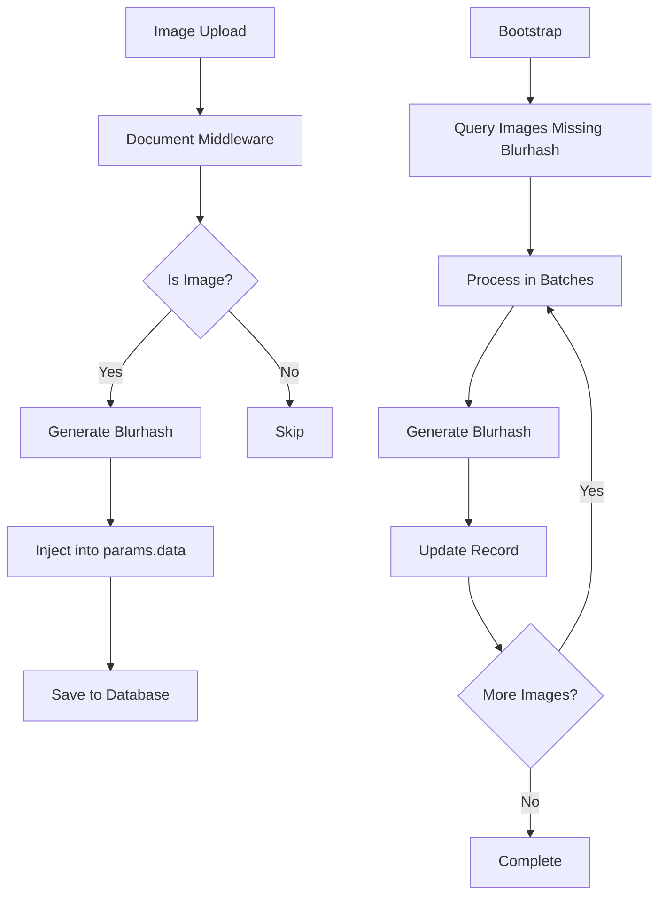

# Bl

urhash Image Processing Implementation

## Overview

Implement blurhash generation for image uploads in Strapi v5. This includes extending the upload plugin schema, adding real-time generation middleware, and backfilling existing images.

## Architecture

The implementation follows the existing audio duration extraction pattern in [`backend/src/index.ts`](backend/src/index.ts), using document service middleware and bootstrap functions.

## Implementation Plan

### Task 1: Setup Phase

**1.1 Add Dependencies**File: [`backend/package.json`](backend/package.json)

- Add `blurhash` (^2.0.0 or latest stable) to dependencies
- Add `sharp` (^0.32.0 or ^0.33.0) to dependencies

**1.2 Extend Upload Schema**File: [`backend/src/extensions/upload/content-types/file/schema.json`](backend/src/extensions/upload/content-types/file/schema.json) (new file)Create schema extension following Strapi v5 format:

- `kind`: "collectionType"
- `collectionName`: "files"
- `info` object with `singularName`, `pluralName`, `displayName`
- `attributes.blurhash`: type "string", optional (no required field)

This schema merges with the existing `plugin::upload.file` schema at startup.

### Task 2: Real-Time Blurhash Generation

**2.1 Create Blurhash Utility**File: [`backend/src/utils/generateBlurhash.ts`](backend/src/utils/generateBlurhash.ts) (new file)

- Import `sharp` and `encode` from `blurhash`
- Accept `Buffer` or Sharp instance
- Resize image to 32x32 or 64x64 using Sharp
- Extract RGBA pixel data
- Encode with `blurhash.encode()` using 4x3 or 4x4 components
- Return `string | null` (null on error to avoid blocking uploads)
- Handle errors gracefully with try-catch

**2.2 Add Middleware**File: [`backend/src/index.ts`](backend/src/index.ts)Add middleware in `register()` function, following the audio duration extraction pattern (lines 128-146):

- Use `strapi.documents.use()` middleware
- Target `plugin::upload.file` content type
- Filter for `create` and `update` actions
- Check `mime` starts with `image/`
- Access file buffer using path resolution pattern from `extractDuration()`:
- Get file URL from `context.params.data.url` or resolve from file record
- Resolve path using `strapi.dirs.public` or `strapi.dirs.static.public`
- Validate path is within public directory (security: prevent path traversal)
- Read file buffer using `fs.readFileSync()` or `fs.promises.readFile()`
- Generate blurhash using utility function
- Inject blurhash into `context.params.data.blurhash`
- Call `next()` after processing
- Wrap in try-catch to avoid blocking operations

### Task 3: Backfill Existing Images

**3.1 Implement Backfill Logic**File: [`backend/src/index.ts`](backend/src/index.ts)Add backfill function in `bootstrap()` after existing search index initialization (after line 192):

- Check `SKIP_BLURHASH_BACKFILL` environment variable
- Query images missing blurhash:
- Use `strapi.documents('plugin::upload.file').findMany()`
- Filters: `mime` starts with `image/`, `blurhash` is null or empty
- Use pagination (pageSize: 10)
- Process each image:
- Resolve file path using same pattern as middleware
- Validate path security
- Read file buffer
- Generate blurhash
- Update record using `strapi.documents('plugin::upload.file').update()`
- Add progress logging: "Processing image X of Y"
- Handle errors gracefully to continue processing

**3.2 Add Safety Measures**

- Environment variable check: `SKIP_BLURHASH_BACKFILL` to disable
- Concurrency limit: process 5-10 images sequentially (batch size 10)
- Log completion statistics: total processed, successful, failed
- Consider tracking completion to avoid re-running (optional enhancement)

## Security Considerations

- Path traversal prevention: validate resolved paths are within public directory (following pattern from `extractDuration()`)
- Error handling: never block uploads if blurhash generation fails
- File access: use secure path resolution with validation

## Files to Create/Modify

1. [`backend/package.json`](backend/package.json) - Add dependencies
2. [`backend/src/extensions/upload/content-types/file/schema.json`](backend/src/extensions/upload/content-types/file/schema.json) - Schema extension (new)
3. [`backend/src/utils/generateBlurhash.ts`](backend/src/utils/generateBlurhash.ts) - Utility function (new)
4. [`backend/src/index.ts`](backend/src/index.ts) - Middleware and bootstrap logic

## Key Implementation Details

**File Access Pattern:**

- Follow `extractDuration()` pattern for file path resolution
- Use `context.params.data.url` for new uploads
- Query file record for updates if URL not available
- Validate paths to prevent traversal attacks

**Error Handling:**

- Return `null` from utility on error
- Log warnings but don't throw in middleware
- Continue processing in backfill on individual failures
- Never block core upload/update operations

**Blurhash Generation:**