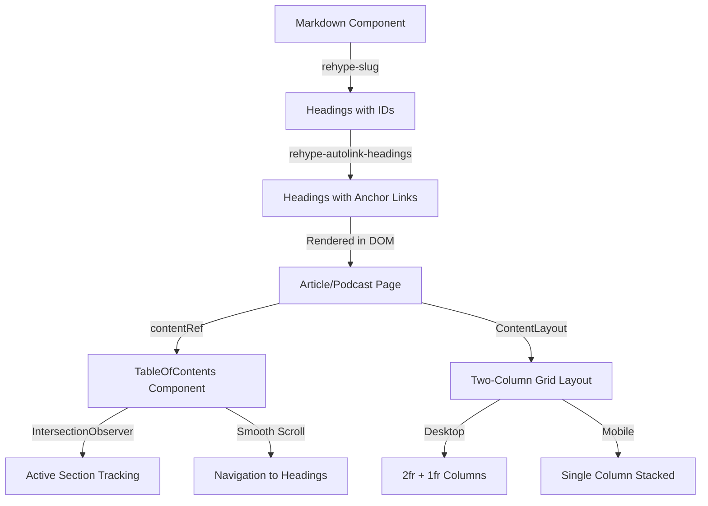

# Heading Anchors and Table of Contents Implementation

## Overview

This plan implements three interconnected features:

1. **Heading anchors** - Automatic ID generation and anchor links for markdown headings
2. **Table of Contents component** - Reusable component with smooth scrolling and active section tracking
3. **Two-column layout integration** - Responsive layout system for content + sidebar

## Architecture




## Implementation Details

### Task 1: Enable Heading Anchors

**Files to modify:**

- `frontend/package.json` - Add dependencies
- `frontend/src/lib/markdown/Markdown.tsx` - Configure rehype plugins
- `frontend/src/styles/global.css` - Add anchor link styles

**Changes:**

1. Install `rehype-slug` and `rehype-autolink-headings` packages
2. Import both plugins in `Markdown.tsx`
3. Add `rehype-slug` to `rehypePlugins` array (runs first to generate IDs)
4. Add `rehype-autolink-headings` with configuration:

- `behavior: 'wrap'` or `behavior: 'append'` for anchor icon
- `properties: { ariaLabel: (heading) => `Link to ${heading.properties.id}` }`
- `content: { type: 'element', tagName: 'span', properties: { className: ['anchor-icon'] } }`

5. Add CSS for anchor links:

- Hidden by default, visible on hover (GitHub pattern)
- Position anchor icon appropriately
- Use existing color variables (`--color-link`, `--color-text-muted`)

### Task 2: Build TableOfContents Component

**Files to create:**

- `frontend/src/components/TableOfContents.tsx`
- `frontend/src/components/TableOfContents.module.css`

**Component structure:**

```typescript
type Heading = {
  id: string;
  text: string;
  level: number;
};

type TableOfContentsProps = {
  contentRef: React.RefObject<HTMLElement>;
};
```

**Implementation steps:**

1. Use `useEffect` to query DOM for `h1-h6` elements within `contentRef.current` after mount
2. Extract heading data (text, id, level) into state as flat array
3. Build hierarchical structure (optional - can render flat with indentation)
4. Implement click handlers:

- Use `scrollIntoView({ behavior: 'smooth', block: 'start' })`
- Update URL hash without scrolling (optional)

5. Set up `IntersectionObserver`:

- Observe all heading elements
- Track which heading is currently visible
- Update active state based on intersection
- Use `rootMargin` to trigger slightly before heading enters viewport

6. Cleanup observer on unmount
7. Accessibility:

- Wrap in `<nav aria-label="Inhaltsverzeichnis">`
- Add `aria-current="location"` to active link
- Ensure keyboard navigation works
- Use semantic HTML (`<ul>`, `<li>`)

**CSS styling:**

- `position: sticky; top: 80px;` for desktop
- Hierarchical indentation based on `heading.level` (e.g., `padding-left: ${(level - 1) * 1.5}rem`)
- Hover and active states
- Focus styles for keyboard navigation
- Mobile: Stack normally (not sticky) or hide below certain breakpoint
- Use existing CSS variables for colors and spacing

**Edge cases:**

- Handle empty headings list (return null)
- Handle headings without IDs (skip them)
- Handle rapid scrolling (debounce/throttle observer updates)
- Handle content changes (re-extract headings if contentRef changes)

### Task 3: Integrate TableOfContents

**Files to modify:**

- `frontend/app/ContentLayout.tsx` - Add sidebar prop
- `frontend/app/ContentLayout.module.css` - Implement grid layout
- `frontend/app/artikel/[slug]/page.tsx` - Add ref and integrate ToC
- `frontend/app/podcasts/[slug]/page.tsx` - Add ref and integrate ToC

**ContentLayout changes:**

1. Add optional `sidebar?: React.ReactNode` prop
2. Conditionally apply grid layout when sidebar exists
3. CSS Grid implementation:

- Desktop (>640px): `grid-template-columns: 2fr 1fr; gap: 2rem;`
- Mobile (≤640px): `grid-template-columns: 1fr;` (sidebar stacks above)
- Maintain `max-width: 1200px` on container
- Ensure proper spacing between columns

**Article page changes:**

1. Convert to client component (or use `'use client'` directive) for ref usage

- Note: Since it's a server component, we'll need to create a client wrapper component for the content area

2. Create `contentRef` using `useRef<HTMLDivElement>(null)`
3. Attach ref to the div containing `Markdown` component (`.content` div)
4. Conditionally render `TableOfContents`:

- Only render if headings exist
- Pass `contentRef` prop

5. Wrap content and sidebar in `ContentLayout`:
   ```tsx
      <ContentLayout sidebar={headingsExist ? <TableOfContents contentRef={contentRef} /> : null}>
        {/* existing article content */}
      </ContentLayout>
   ```


**Podcast page changes:**

1. Follow same pattern as article page
2. Create ref for shownotes container
3. Conditionally render ToC only when headings exist

**Client component wrapper approach:**

Since article/podcast pages are server components, we have two options:

- Option A: Create a client wrapper component for the content area that handles the ref
- Option B: Use a separate client component that wraps both content and ToC

**Recommended approach:** Create `ArticleContent.tsx` and `PodcastContent.tsx` client components that:

- Accept content as props
- Manage the contentRef
- Render Markdown with ref attached
- Conditionally render TableOfContents
- Return both wrapped in ContentLayout

**Alternative simpler approach:** Use a client component wrapper just for the content div:

```tsx
// ClientContentWrapper.tsx (client component)
'use client';
export function ClientContentWrapper({ children, contentRef }) {
  return <div ref={contentRef}>{children}</div>;
}
```

Then in server component:

```tsx
<ClientContentWrapper contentRef={contentRef}>
  <Markdown markdown={content} />
</ClientContentWrapper>
```


## Testing Considerations

1. Test with various heading structures (nested, flat, missing IDs)
2. Test smooth scrolling behavior
3. Test active section tracking during scroll
4. Test responsive layout (mobile vs desktop)
5. Test keyboard navigation
6. Test with empty content (no headings)
7. Verify no layout shift on mobile
8. Test anchor link visibility on hover

## Dependencies

- `rehype-slug`: ^6.0.0 (or latest compatible)
- `rehype-autolink-headings`: ^7.0.0 (or latest compatible)

## CSS Variables to Use

- `--color-link` - For anchor links
- `--color-text-muted` - For ToC text
- `--color-border` - For ToC separators
- `--border-radius` - For rounded corners