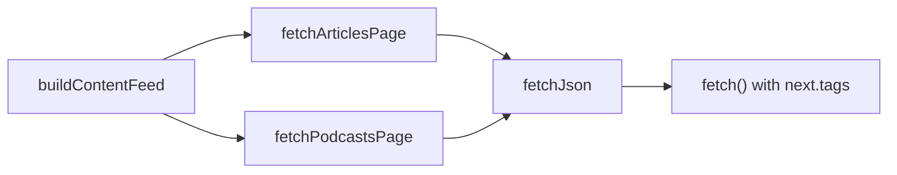

# Add `page:home` cache tag to homepage feed fetching

## What we’re changing
- Add a typed `options` parameter to `buildContentFeed()` so callers can supply additional cache tags.
- Merge caller tags with the existing Strapi content-type tags used by `fetchArticlesPage()` / `fetchPodcastsPage()`, deduplicated.
- Update the homepage and the merged contentfeed API route to pass `tags: ['page:home']`.

## Why this works
- `frontend/src/lib/strapiContent.ts` already propagates tags to Next’s fetch cache:
  - `fetchArticlesPage()` / `fetchPodcastsPage()` accept `tags?: string[]` (via `FetchPageOptions`).
  - They pass `tags` into `fetchJson()`.
  - `fetchJson()` calls `fetch()` with `next: { tags: options.tags }`.
- By adding `page:home` to the tag list used by the Strapi list-page fetches, any invalidation for `page:home` will evict the cached Strapi responses that power the homepage feed.

## Implementation steps
- Update `[frontend/src/lib/contentFeed.ts](/Users/nerlich/workspace/luca/m10z/frontend/src/lib/contentFeed.ts)`
  - Define:
    - `export interface ContentFeedOptions { tags?: string[] }`
  - Change signature to:
    - `export async function buildContentFeed(page: number, pageSize: number, options?: ContentFeedOptions): Promise<ContentFeedResponse>`
  - When calling `fetchArticlesPage()` / `fetchPodcastsPage()`, pass merged tags:
    - Start from the existing content-type tags:
      - Articles: `['strapi:article', 'strapi:article:list:page']`
      - Podcasts: `['strapi:podcast', 'strapi:podcast:list:page']`
    - Merge with `options?.tags ?? []` using `Array.from(new Set([...baseTags, ...extraTags]))`.

- Update `[frontend/src/components/HomePage.tsx](/Users/nerlich/workspace/luca/m10z/frontend/src/components/HomePage.tsx)`
  - Change the call to `buildContentFeed(page, PAGE_SIZE, { tags: ['page:home'] })`.

- Update `[frontend/app/api/contentfeed/route.ts](/Users/nerlich/workspace/luca/m10z/frontend/app/api/contentfeed/route.ts)`
  - Change the call to `buildContentFeed(page, pageSize, { tags: ['page:home'] })`.

## Verification (quick, code-level)
- Confirm `fetchArticlesPage()` / `fetchPodcastsPage()` still pass their `tags` into `fetchJson()` (they do today).
- Confirm `fetchJson()` sets `next.tags` on `fetch()` (it does today).

## Flow diagram
