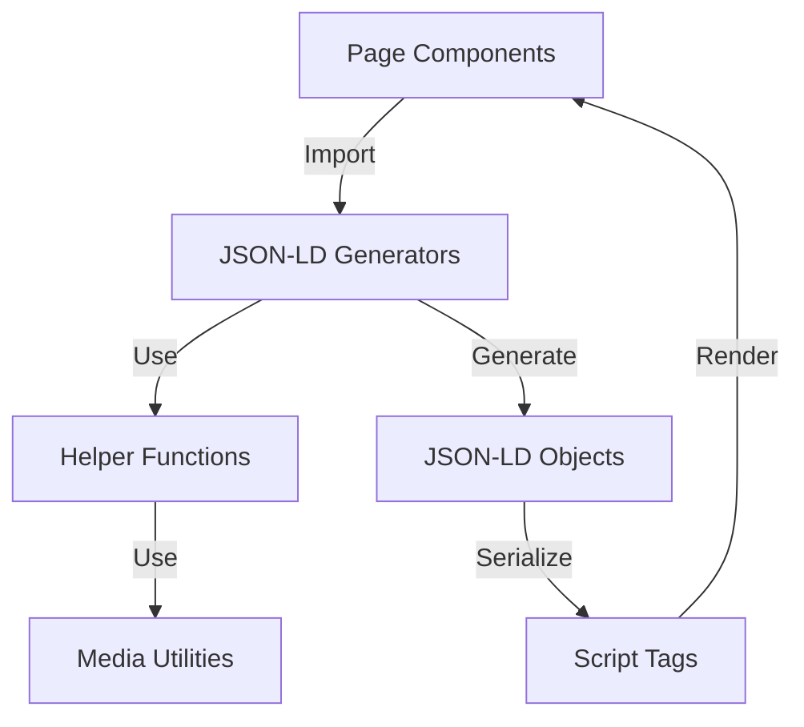

# JSON-LD Structured Data Implementation

## Overview

Add schema.org JSON-LD structured data to enhance SEO for articles, podcasts, and the homepage. The implementation follows existing patterns from RSS generation utilities and integrates seamlessly with Next.js App Router server components.

## Architecture




## Implementation Tasks

### Task 1: Create JSON-LD Generation Utilities

#### 1.1 Module Structure

Create `frontend/src/lib/jsonld/` directory with:

- `types.ts` - TypeScript types for schema.org entities
- `helpers.ts` - Utility functions for date formatting, URL normalization, image construction
- `article.ts` - BlogPosting schema generator
- `podcast.ts` - PodcastEpisode schema generator  
- `organization.ts` - Organization schema generator
- `website.ts` - WebSite schema generator (with SearchAction)

#### 1.2 Type Definitions (`types.ts`)

Define TypeScript interfaces for schema.org types:

- `JsonLdBase` - Base with `@context` and `@type`
- `BlogPosting` - Article schema
- `PodcastEpisode` - Podcast schema
- `Organization` - Organization schema
- `Person` - Author schema
- `ImageObject` - Image schema
- `AudioObject` - Audio media schema
- `PodcastSeries` - Series schema
- `WebSite` - Website schema with SearchAction

#### 1.3 Helper Functions (`helpers.ts`)

Create utilities:

- `formatIso8601Date(date: string | null): string | undefined` - Convert dates to ISO-8601 format
- `normalizeUrl(path: string, baseUrl: string): string` - Build absolute URLs
- `buildImageObject(url: string, width?: number, height?: number): ImageObject` - Construct ImageObject schema
- Reuse `mediaUrlToAbsolute` from `frontend/src/lib/rss/media.ts` for media URLs

#### 1.4 Article Generator (`article.ts`)

Function: `generateArticleJsonLd(article: StrapiArticle, siteUrl: string, strapiUrl: string): BlogPosting`Maps article fields to BlogPosting schema:

- `@context`: "https://schema.org"
- `@type`: "BlogPosting"
- `headline`: `article.base.title`
- `description`: `article.base.description`
- `datePublished`: ISO-8601 from `getEffectiveDate(article)`
- `dateModified`: ISO-8601 from `article.publishedAt` (fallback to datePublished)
- `articleBody`: `article.content` (markdown, can be converted to HTML or left as-is)
- `url`: Absolute URL using `routes.article(article.slug)` and `absoluteRoute()`
- `image`: Array of ImageObject from `article.base.cover` and `article.base.banner` (via `pickCoverMedia`/`pickBannerMedia`)
- `author`: Array of Person objects from `article.authors` (name, url, image from avatar)
- `publisher`: Organization object (reuse `generateOrganizationJsonLd()`)
- `mainEntityOfPage`: URL

#### 1.5 Podcast Generator (`podcast.ts`)

Function: `generatePodcastJsonLd(podcast: StrapiPodcast, siteUrl: string, strapiUrl: string): PodcastEpisode`Maps podcast fields to PodcastEpisode schema:

- `@context`: "https://schema.org"
- `@type`: "PodcastEpisode"
- `name`: `podcast.base.title`
- `description`: `podcast.base.description`
- `datePublished`: ISO-8601 from `getEffectiveDate(podcast)`
- `duration`: Convert `podcast.duration` (seconds) to ISO-8601 duration format (PT#M#S)
- `associatedMedia`: AudioObject with:
- `@type`: "AudioObject"
- `contentUrl`: Absolute URL from `podcast.file` via `mediaUrlToAbsolute`
- `encodingFormat`: MIME type from `podcast.file.mime`
- `duration`: ISO-8601 duration
- `image`: Array of ImageObject from cover media
- `author`: Array of Person objects from `podcast.authors`
- `partOfSeries`: PodcastSeries with:
- `@type`: "PodcastSeries"
- `name`: "M10Z Podcasts" (or from config)
- `url`: `routes.podcasts`
- `url`: Absolute URL using `routes.podcast(podcast.slug)`

#### 1.6 Organization Generator (`organization.ts`)

Function: `generateOrganizationJsonLd(siteUrl: string): Organization`Builds Organization schema:

- `@context`: "https://schema.org"
- `@type`: "Organization"
- `name`: "Mindestens 10 Zeichen"
- `alternateName`: "M10Z"
- `url`: `siteUrl`
- `logo`: ImageObject pointing to `/logo.svg` (absolute URL)
- `sameAs`: Array of social media URLs from `routes` object:
- `routes.youtube`
- `routes.twitch`
- `routes.discord`
- `routes.forum`
- `routes.linktree`

#### 1.7 Website Generator (`website.ts`)

Function: `generateWebsiteJsonLd(siteUrl: string): WebSite`Builds WebSite schema with SearchAction:

- `@context`: "https://schema.org"
- `@type`: "WebSite"
- `name`: "Mindestens 10 Zeichen"
- `url`: `siteUrl`
- `potentialAction`: SearchAction object:
- `@type`: "SearchAction"
- `target`: `{ "@type": "EntryPoint", "urlTemplate": "${siteUrl}/api/search-index?q={search_term_string}" }`
- `query-input`: "required name=search_term_string"

### Task 2: Integrate JSON-LD into Page Components

#### 2.1 Article Page (`frontend/app/artikel/[slug]/page.tsx`)

- Import `generateArticleJsonLd` from `@/src/lib/jsonld/article`
- Import `routes` and `absoluteRoute` from `@/src/lib/routes`
- After fetching article, generate JSON-LD: `const jsonLd = generateArticleJsonLd(article, routes.siteUrl, STRAPI_URL)`
- Add script tag before `<main>`:
```tsx
<script
  type="application/ld+json"
  dangerouslySetInnerHTML={{ __html: JSON.stringify(jsonLd) }}
/>
```


#### 2.2 Podcast Page (`frontend/app/podcasts/[slug]/page.tsx`)

- Import `generatePodcastJsonLd` from `@/src/lib/jsonld/podcast`
- Import `routes` and `absoluteRoute` from `@/src/lib/routes`
- After fetching podcast, generate JSON-LD: `const jsonLd = generatePodcastJsonLd(podcast, routes.siteUrl, STRAPI_URL)`
- Add script tag before `<main>`:
```tsx
<script
  type="application/ld+json"
  dangerouslySetInnerHTML={{ __html: JSON.stringify(jsonLd) }}
/>
```


#### 2.3 Homepage (`frontend/app/page.tsx`)

- Import `generateOrganizationJsonLd` and `generateWebsiteJsonLd` from respective modules
- Import `routes` from `@/src/lib/routes`
- Generate both schemas: `const orgJsonLd = generateOrganizationJsonLd(routes.siteUrl)` and `const websiteJsonLd = generateWebsiteJsonLd(routes.siteUrl)`
- Add script tags in the component (before content or in a fragment):
```tsx
<>
  <script
    type="application/ld+json"
    dangerouslySetInnerHTML={{ __html: JSON.stringify(orgJsonLd) }}
  />
  <script
    type="application/ld+json"
    dangerouslySetInnerHTML={{ __html: JSON.stringify(websiteJsonLd) }}
  />
  {/* existing content */}
</>
```


## Key Implementation Details

### Date Handling

- Use `getEffectiveDate()` from `frontend/src/lib/effectiveDate.ts` to get publication dates
- Convert to ISO-8601 format: `new Date(dateString).toISOString()`
- Handle null/undefined gracefully

### URL Construction

- Use `absoluteRoute()` from `frontend/src/lib/routes.ts` for absolute URLs
- Use `routes.article()`, `routes.podcast()` for relative paths
- Use `mediaUrlToAbsolute()` from `frontend/src/lib/rss/media.ts` for media URLs

### Media Handling

- Reuse `normalizeStrapiMedia()`, `pickCoverMedia()`, `pickBannerMedia()` from `frontend/src/lib/rss/media.ts`
- Extract width/height from media objects for ImageObject schemas
- Handle missing media gracefully (optional fields)

### Duration Format

- Convert seconds to ISO-8601 duration: `PT${Math.floor(seconds/60)}M${seconds%60}S`
- Example: 3661 seconds → "PT61M1S"

### Type Safety

- Import types from existing modules (`StrapiArticle`, `StrapiPodcast`, `StrapiAuthor`)
- Use TypeScript interfaces for all JSON-LD objects
- Ensure all required schema.org fields are present

## Files to Create/Modify

### New Files

- `frontend/src/lib/jsonld/types.ts`
- `frontend/src/lib/jsonld/helpers.ts`
- `frontend/src/lib/jsonld/article.ts`
- `frontend/src/lib/jsonld/podcast.ts`
- `frontend/src/lib/jsonld/organization.ts`
- `frontend/src/lib/jsonld/website.ts`

### Modified Files

- `frontend/app/artikel/[slug]/page.tsx` - Add JSON-LD script
- `frontend/app/podcasts/[slug]/page.tsx` - Add JSON-LD script
- `frontend/app/page.tsx` - Add Organization and WebSite JSON-LD scripts

## Testing Considerations

- Validate JSON-LD output using Google's Rich Results Test
- Ensure all URLs are absolute
- Verify dates are in ISO-8601 format