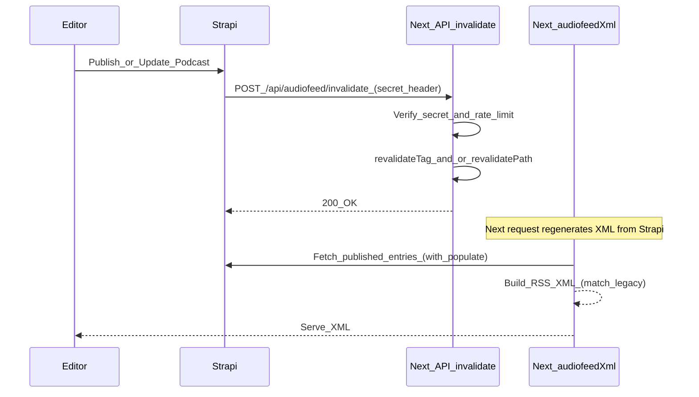

# m10z 2.0 (Strapi + Next.js) Migration Plan

## Target end state (confirmed)

- **Frontend**: Next.js App Router in [`frontend/`](frontend/) is the public site (full cutover).
- **Backend/CMS**: Strapi in [`backend/`](backend/) is the single source of truth for articles, podcasts, categories, authors, and legal pages.
- **Content format**: Strapi `richtext` is treated as **Markdown** and rendered via `react-markdown` (no raw HTML rendering).
- **Audio hosting**: Podcast MP3s are **uploaded to Strapi** (self-hosted), so RSS `<enclosure>` URLs point at Strapi-served files.

## What’s already scaffolded (so we build on it)

- **Strapi schemas** already exist for `article`, `podcast`, `author`, `category`, single-types `audio-feed` and `article-feed` under [`backend/src/api/`](backend/src/api/).
- **Next.js routing skeleton** exists for content pages + feed endpoints under [`frontend/app/`](frontend/app/).
- **Strapi fetch helper** exists at [`frontend/src/lib/strapi.ts`](frontend/src/lib/strapi.ts) (needs small cleanup: it uses `NEXT_PUBLIC_STRAPI_URL` but error strings mention `STRAPI_API_URL`).
- **Legacy RSS generator** exists at [`scripts/generateAudioFeed.js`](scripts/generateAudioFeed.js) and defines the canonical audio RSS format.

## Architecture & data flows

## Phase 0 — Decide/standardize config (small but important)

- **Environment variables**:
- Standardize Strapi base URL to a single server-only var (recommend `STRAPI_URL`) and update [`frontend/src/lib/strapi.ts`](frontend/src/lib/strapi.ts) accordingly.
- Add `FEED_INVALIDATION_SECRET` (Next) and matching `NEXT_INVALIDATION_SECRET` (Strapi) to avoid hardcoding secrets.

## Phase 1 — Finish the RSS endpoints (compatibility-first)

### Audio feed `/audiofeed.xml`

Implement [`frontend/app/audiofeed.xml/route.ts`](frontend/app/audiofeed.xml/route.ts) to match the current canonical format from [`static/audiofeed.xml`](static/audiofeed.xml):

- **Namespaces & channel fields**: include `atom`, `podcast`, `itunes`, `ttl`, `podcast:guid`, and the exact structure from [`templates/rss-channel.xml`](templates/rss-channel.xml).
- **Item mapping** (from Strapi `podcast` entries):
- `<title>`: `podcast.base.title`
- `<pubDate>` + `<lastBuildDate>`: `publishedAt` formatted as RFC 2822/UTC
- `<guid isPermaLink="false">`: SHA256 of the enclosure URL (same as legacy `toHash(episode.url)`)
- `<itunes:image href="…"/>`: `podcast.base.cover` (or banner if you prefer; decide once and keep stable)
- `<description><![CDATA[…]]></description>`: **Markdown → HTML** conversion using the existing logic in [`scripts/markdownToHtml.js`](scripts/markdownToHtml.js) (ported to TS for reuse)
- `<itunes:duration>`: seconds (your Strapi schema already stores integer seconds)
- `<enclosure>`: URL to Strapi-hosted MP3 + byte length from Strapi upload metadata
- **Caching**: use Next.js caching with tags (e.g. `feed:audio`) so you can invalidate quickly.

### Article feed `/rss.xml`

Implement [`frontend/app/rss.xml/route.ts`](frontend/app/rss.xml/route.ts):

- Generate standard RSS 2.0 feed for articles (channel metadata from Strapi `article-feed` single-type).
- Items: title, link, pubDate, guid, and description (teaser/intro) + optional full content.
- Cache with tag `feed:article`.

## Phase 2 — Secure invalidation endpoints (publish → revalidate)

Implement:

- [`frontend/app/api/audiofeed/invalidate/route.ts`](frontend/app/api/audiofeed/invalidate/route.ts)
- [`frontend/app/api/articlefeed/invalidate/route.ts`](frontend/app/api/articlefeed/invalidate/route.ts)

Security requirements (secure-by-default):

- **Secret in header** (as your backend README suggests), compare with constant-time check.
- **Rate limit** (simple in-memory per-IP is fine to start).
- **Fail securely**: return 401/429 without revealing secret expectations; do not log secrets.

## Phase 3 — Strapi publish hooks

Add lifecycle hooks in Strapi so changes trigger invalidation:

- [`backend/src/api/podcast/content-types/podcast/lifecycles.ts`](backend/src/api/podcast/content-types/podcast/lifecycles.ts)
- [`backend/src/api/article/content-types/article/lifecycles.ts`](backend/src/api/article/content-types/article/lifecycles.ts)

Behavior:

- On create/update/delete and publish/unpublish events (depending on Strapi event payload), call the matching Next invalidate endpoint.
- Use HTTPS and a configured `NEXT_PUBLIC_SITE_URL`/`NEXT_SITE_URL` and secret header.
- Avoid retry storms: log failures, but don’t block the Strapi write path.

## Phase 4 — Build out Next.js pages

Implement real data rendering (currently placeholders) for:

- [`frontend/app/page.tsx`](frontend/app/page.tsx) (latest articles + latest podcasts)
- [`frontend/app/artikel/page.tsx`](frontend/app/artikel/page.tsx) and `[frontend/app/artikel/[slug]/page.tsx](frontend/app/artikel/[slug]/page.tsx)`
- [`frontend/app/podcasts/page.tsx`](frontend/app/podcasts/page.tsx) and `[frontend/app/podcasts/[slug]/page.tsx](frontend/app/podcasts/[slug]/page.tsx)`
- [`frontend/app/kategorien/page.tsx`](frontend/app/kategorien/page.tsx) and `[frontend/app/kategorien/[slug]/page.tsx](frontend/app/kategorien/[slug]/page.tsx)`

Use tag-based caching for lists/details so Strapi hooks can invalidate the right slices later (`revalidateTag('podcast')`, etc.).

## Phase 5 — Migration (legacy → Strapi)

### Content

- **Articles**: import from [`blog/articles/`](blog/articles/) MD/MDX into `article` entries.
- **Podcast episodes**: import from [`static/audiofeed/episodes/`](static/audiofeed/episodes/) into `podcast` entries.
- **Authors**: import from [`blog/authors.yml`](blog/authors.yml) into `author`.
- **Categories**: map from folder names/tags to `category` entries.

### Media

- **Images**: import from [`static/img/`](static/img/) into Strapi media; update references in Markdown.
- **Audio MP3s**: download legacy MP3s (from URLs in episode frontmatter) and upload into Strapi media, then set `podcast.file`.

Security controls for migration tooling:

- **SSRF prevention**: allowlist hostnames for downloads (e.g. `m10z.picnotes.de`, `m10z.adrilaida.de`) and enforce https.
- **Size limits**: enforce max file size and timeouts.

## Phase 6 — Cutover & SEO

- Keep URL structure stable where possible (`/artikel/[slug]`, `/podcasts/[slug]`, `/kategorien/[slug]`, `/rss.xml`, `/audiofeed.xml`).
- Add redirects from old Docusaurus routes to Next where needed.
- Verify RSS consumers: validate XML, enclosure URLs, and `guid` stability.

## Compatibility checklist (must pass before switching DNS)

- `audiofeed.xml` matches the legacy feed structure: namespaces, channel fields, item fields, CDATA descriptions, GUID hashing.
- Enclosure `length` is correct bytes.