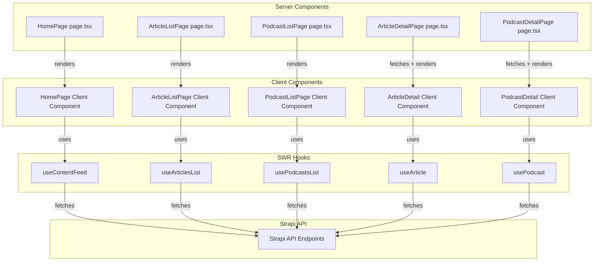

# Migrate to Client-Side

SWR Data Fetching

## Overview

This plan migrates the Next.js application from server-side data fetching to client-side rendering using SWR hooks, while preserving server-side metadata generation for SEO. The migration follows a hybrid approach where detail pages fetch data server-side for metadata generation and pass it as `initialData` to SWR hooks for client-side revalidation.

## Architecture

## Implementation Tasks

### Task 1: Create Custom SWR Hooks

**File: `frontend/src/hooks/useStrapiContent.ts`** (new file)Create SWR hooks that wrap `useSWR` to fetch from Strapi API endpoints:

1. **`useArticlesList(page, pageSize)`**

- Build query string using `qs.stringify()` matching `fetchArticlesPage()` populate structure
- Use `NEXT_PUBLIC_STRAPI_URL` + `/api/articles?${query}`
- Return `PaginatedResult<StrapiArticle>` with loading/error states
- Handle pagination parameters (defaults: page=1, pageSize=20)

2. **`usePodcastsList(page, pageSize)`**

- Build query string matching `fetchPodcastsPage()` populate structure
- Use `NEXT_PUBLIC_STRAPI_URL` + `/api/podcasts?${query}`
- Return `PaginatedResult<StrapiPodcast>` with loading/error states
- Handle pagination parameters (defaults: page=1, pageSize=20)

3. **`useArticle(slug, initialData?)`**

- Build query string matching `fetchArticleBySlug()` populate structure
- Use conditional fetching: return `null` key when slug is null/undefined
- Accept optional `initialData` for server-side hydration
- Return `StrapiArticle | null` with loading/error states

4. **`usePodcast(slug, initialData?)`**

- Build query string matching `fetchPodcastBySlug()` populate structure
- Use conditional fetching: return `null` key when slug is null/undefined
- Accept optional `initialData` for server-side hydration
- Return `StrapiPodcast | null` with loading/error states

5. **`useContentFeed(page, pageSize)`**

- Fetch articles and podcasts in parallel using `useArticlesList()` and `usePodcastsList()`
- Merge results and sort by `publishedAt` using `getEffectiveDate()` and `sortByDateDesc()`
- Handle pagination by slicing the merged array
- Handle partial failure scenarios (show available data if one fetch fails)
- Return combined feed items with pagination metadata

**Key Implementation Details:**

- Use `qs.stringify()` with `{encodeValuesOnly: true}` to match existing query structure
- Include `status: 'published'` filter in queries
- Use same populate fields as existing fetch functions
- Return SWR's standard `{data, error, isLoading, isValidating}` structure
- For `useContentFeed`, handle loading states from both hooks

### Task 2: Migrate Homepage to Client-Side Rendering

**File: `frontend/app/page.tsx`**

- Remove `FeedContent` server component definition
- Remove server-side fetch calls (`fetchArticlesPage`, `fetchPodcastsPage`)
- Keep as Server Component for metadata generation
- Render `HomePage` client component
- Preserve `metadata` export unchanged

**File: `frontend/src/components/HomePage.tsx`** (new file)

- Add `"use client"` directive
- Move `FeedContent` logic into this component
- Use `useContentFeed(page, pageSize)` hook for data fetching
- Parse `page` from `searchParams` (handle Promise if needed)
- Implement loading skeleton using existing `FeedSkeleton` component
- Preserve table of contents rendering
- Preserve pagination controls with `Pagination` component
- Add error handling with user-friendly messages and retry capability
- Keep all existing mapping functions (`mapArticlesToFeed`, `mapPodcastsToFeed`)
- Preserve sorting logic using `sortByDateDesc()` and `toDateTimestamp()`

**Key Implementation Details:**

- Handle `searchParams` as Promise (Next.js 15+ pattern)
- Use `useSearchParams()` hook to read page parameter client-side
- Maintain same pagination logic (`clampPageToData`, `hasNextPage`)
- Preserve all existing styling and layout

### Task 3: Migrate List Pages to Client-Side Rendering

**File: `frontend/app/artikel/page.tsx`**

- Remove server-side `fetchArticlesList()` call
- Keep as Server Component for metadata generation
- Render `ArticleListPage` client component
- Preserve `metadata` export unchanged

**File: `frontend/src/components/ArticleListPage.tsx`** (new file)

- Add `"use client"` directive
- Use `useArticlesList(page, pageSize)` hook
- Render using existing `ArticleCard` and `ContentGrid` components
- Implement loading skeleton matching grid layout (create `ArticleListSkeleton` component)
- Add error handling with retry capability
- Sort articles using `sortByDateDesc()` (defensive client-side sorting)
- Handle empty state

**File: `frontend/app/podcasts/page.tsx`**

- Remove server-side `fetchPodcastsList()` call
- Keep as Server Component for metadata generation
- Render `PodcastListPage` client component
- Preserve `metadata` export unchanged

**File: `frontend/src/components/PodcastListPage.tsx`** (new file)

- Add `"use client"` directive
- Use `usePodcastsList(page, pageSize)` hook
- Render using existing `PodcastCard` and `ContentGrid` components
- Implement loading skeleton consistent with `ArticleListPage`
- Add error handling with retry capability
- Sort podcasts using `sortByDateDesc()` (defensive client-side sorting)
- Handle empty state

**Key Implementation Details:**

- Create reusable skeleton components for list pages
- Use same grid layout and styling as existing pages
- Preserve component props (`showAuthors`, `showCategories`)

### Task 4: Migrate Detail Pages to Hybrid Pattern

**File: `frontend/app/artikel/[slug]/page.tsx`**

- Keep `generateMetadata()` unchanged (server-side fetch for SEO)
- Keep server-side `fetchArticleBySlug()` call for metadata
- Pass fetched article data as props to `ArticleDetail` client component
- Ensure page remains a Server Component
- Handle `notFound()` when article is null

**File: `frontend/src/components/ArticleDetail.tsx`** (new file)

- Add `"use client"` directive
- Accept `article: StrapiArticle | null` and `slug: string` as props
- Use `useArticle(slug, article)` hook with `initialData` set to `article`
- Move rendering logic from `artikel/[slug]/page.tsx`
- Preserve `MarkdownClient` for markdown rendering
- Handle loading states for subsequent navigation (when slug changes)
- Implement reading time calculation client-side using `calculateReadingTime()`
- Preserve JSON-LD schema generation using `generateArticleJsonLd()`
- Preserve all existing components (`ContentImage`, `ContentMetadata`, `Section`, `YoutubeSection`)

**File: `frontend/app/podcasts/[slug]/page.tsx`**

- Keep `generateMetadata()` unchanged (server-side fetch for SEO)
- Keep server-side `fetchPodcastBySlug()` call for metadata
- Pass fetched podcast data as props to `PodcastDetail` client component
- Ensure page remains a Server Component
- Handle `notFound()` when podcast is null

**File: `frontend/src/components/PodcastDetail.tsx`** (new file)

- Add `"use client"` directive
- Accept `podcast: StrapiPodcast | null` and `slug: string` as props
- Use `usePodcast(slug, podcast)` hook with `initialData` set to `podcast`
- Move rendering logic from `podcasts/[slug]/page.tsx`
- Preserve audio player rendering (`PodcastPlayer` component)
- Preserve markdown shownotes rendering using `MarkdownClient`
- Handle loading states for subsequent navigation (when slug changes)
- Maintain JSON-LD schema generation using `generatePodcastJsonLd()`
- Preserve all existing components (`ContentImage`, `ContentMetadata`, `Section`, `YoutubeSection`)

**Key Implementation Details:**

- Server fetches data once for metadata generation
- Client receives data as `initialData` to avoid loading flash
- SWR handles subsequent revalidation and navigation
- Preserve all existing styling and component structure
- Handle slug validation using `validateSlugSafe()` on server side

## Files to Create

1. `frontend/src/hooks/useStrapiContent.ts` - All SWR hooks for Strapi content
2. `frontend/src/components/HomePage.tsx` - Homepage client component
3. `frontend/src/components/ArticleListPage.tsx` - Article list client component
4. `frontend/src/components/PodcastListPage.tsx` - Podcast list client component
5. `frontend/src/components/ArticleDetail.tsx` - Article detail client component
6. `frontend/src/components/PodcastDetail.tsx` - Podcast detail client component
7. `frontend/src/components/ArticleListSkeleton.tsx` - Loading skeleton for article list
8. `frontend/src/components/PodcastListSkeleton.tsx` - Loading skeleton for podcast list

## Files to Modify

1. `frontend/app/page.tsx` - Remove FeedContent, render HomePage client component
2. `frontend/app/artikel/page.tsx` - Remove fetch call, render ArticleListPage client component
3. `frontend/app/podcasts/page.tsx` - Remove fetch call, render PodcastListPage client component
4. `frontend/app/artikel/[slug]/page.tsx` - Pass data to ArticleDetail client component
5. `frontend/app/podcasts/[slug]/page.tsx` - Pass data to PodcastDetail client component

## Dependencies

- `swr` - Already installed and configured
- `qs` - Already used in `strapiContent.ts` for query string building
- All existing components and utilities remain unchanged

## Testing Considerations

- Verify SWR hooks handle loading, error, and success states correctly
- Test pagination on homepage and list pages
- Verify detail pages receive initialData and handle navigation correctly