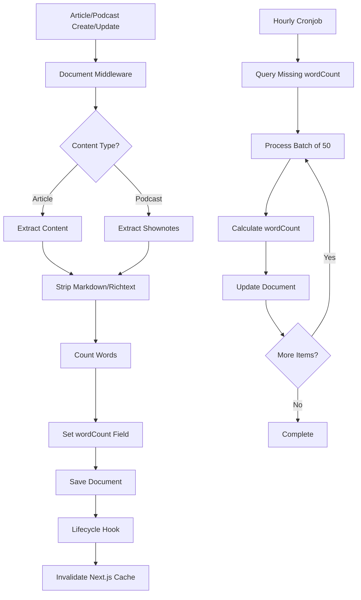

# Word Count Calculation and Reading Time Optimization

## Overview

Implement automatic word count calculation for articles and podcasts using Strapi v5 document middleware API, optimize frontend reading time calculation to use stored wordCount instead of loading full content, add hourly cronjob to backfill missing wordCounts, refactor middleware functions into separate modules for better organization, and refactor cronjobs into separate modules.

## Architecture

The implementation follows existing patterns:

- Document middleware pattern from [`backend/src/index.ts`](backend/src/index.ts) (extractDuration)
- Cronjob pattern from [`backend/config/server.ts`](backend/config/server.ts) (blurhash generation)
- Word counting logic similar to [`frontend/src/lib/readingTime.ts`](frontend/src/lib/readingTime.ts)
- Minimal lifecycle hooks pattern from [`backend/src/api/author/content-types/author/lifecycles.ts`](backend/src/api/author/content-types/author/lifecycles.ts) (only cache invalidation)

**Two-Tier Approach:**

- **Middleware (Real-time)**: Calculates wordCount immediately when articles/podcasts are created or updated. This ensures all new and updated content has wordCount calculated right away.
- **Cronjob (Backfill)**: Processes existing articles/podcasts that don't have wordCount yet (e.g., created before middleware was implemented, or if calculation failed). Runs hourly to gradually backfill missing wordCounts.



## Implementation Plan

### Task 1: Create Middleware Modules and Word Count Middleware

**1.1 Create Middleware Directory Structure**

Directory: [`backend/src/middlewares/`](backend/src/middlewares/) (new directory)

**1.2 Create Shared Word Count Utility**

File: [`backend/src/middlewares/wordCount.ts`](backend/src/middlewares/wordCount.ts) (new file)

- Export `countWords` function:
  - Accepts markdown/richtext string
  - Wrap entire function body in try-catch
  - On error: log error using `strapi.log.error()` and return 0 (never throw)
  - Strips markdown syntax using same regex patterns as [`frontend/src/lib/readingTime.ts`](frontend/src/lib/readingTime.ts)
  - Strips HTML tags if present
  - Normalizes whitespace: replace multiple spaces with single space, trim
  - Splits on whitespace and filters empty strings
  - Returns word count number (0 for null/empty input or on any error)
- Export `extractWordCount` function:
  - Signature: `async (strapi: any, data: any, contentType: 'article' | 'podcast'): Promise<void>`
  - Wrap entire function body in try-catch
  - On error: log error using `strapi.log.error()` and return early (never throw)
  - **For articles (`contentType === 'article'`)**: Extract `data.content` field and calculate wordCount
  - **For podcasts (`contentType === 'podcast'`)**: Extract `data.shownotes` field and calculate wordCount
  - Calculate wordCount using `countWords` function with the extracted content/shownotes (already handles errors)
  - Set `data.wordCount` with calculated value (0 if content/shownotes is null/empty or on error)
  - **CRITICAL**: Never throw errors - only log and continue. Save operation must always proceed.

**1.3 Create Word Count Middleware Function**

File: [`backend/src/middlewares/wordCount.ts`](backend/src/middlewares/wordCount.ts) (add to same file)

- Export `wordCountMiddleware` function:
  - Signature: `async (context: {uid: string; action: string; params?: any}, next: () => Promise<unknown}): Promise<unknown>`
  - Wrap entire middleware in try-catch
  - On error: log error using `strapi.log.error()` and continue to `next()` (never throw)
  - Check if `context.uid` is `'api::article.article'` or `'api::podcast.podcast'`
  - Check if action is `'create'` or `'update'`
  - Extract `context.params?.data`
  - Determine contentType based on `context.uid`:
    - If `context.uid === 'api::article.article'`: call `extractWordCount(strapi, data, 'article')` (extracts from `data.content`)
    - If `context.uid === 'api::podcast.podcast'`: call `extractWordCount(strapi, data, 'podcast')` (extracts from `data.shownotes`)
  - `extractWordCount` already handles errors internally and sets `data.wordCount`
  - **CRITICAL**: Always call `next()` even if word count calculation fails - never block the save operation
  - Return result from `next()` call

**1.4 Extract Duration Middleware**

File: [`backend/src/middlewares/duration.ts`](backend/src/middlewares/duration.ts) (new file)

- Move `extractDuration` function from [`backend/src/index.ts`](backend/src/index.ts) (lines 13-100)
- Export `durationMiddleware` function:
  - Signature: `async (context: {uid: string; action: string; params?: any}, next: () => Promise<unknown>): Promise<unknown>`
  - Check if `context.uid === 'api::podcast.podcast'` and action is `'create'` or `'update'`
  - Extract `context.params?.data`
  - Call `extractDuration` if `data?.file` exists
  - Call `next()` to continue middleware chain
  - Wrap in try-catch for error handling

**1.5 Extract Cache Invalidation Middleware**

File: [`backend/src/middlewares/cacheInvalidation.ts`](backend/src/middlewares/cacheInvalidation.ts) (new file)

- Export `cacheInvalidationMiddleware` function:
  - Signature: `async (context: {uid: string; action: string}, next: () => Promise<unknown>): Promise<unknown>`
  - Move cache invalidation logic from [`backend/src/index.ts`](backend/src/index.ts) (lines 156-182)
  - Define `publishTargets`, `updateTargets`, `searchTargets`, `rebuildActions` maps/sets
  - Call `next()` first (run core operation)
  - After operation succeeds, handle cache invalidation:
    - Check publish/update targets for feed invalidation
    - Check rebuild actions and search targets for search index rebuild
  - Import `invalidateNext` and `buildAndPersistSearchIndex`

**1.6 Update Main Index File**

File: [`backend/src/index.ts`](backend/src/index.ts)

- Import middleware functions:
  ```typescript
  import {wordCountMiddleware} from './middlewares/wordCount';
  import {durationMiddleware} from './middlewares/duration';
  import {cacheInvalidationMiddleware} from './middlewares/cacheInvalidation';
  ```

- In `register()` function:
  - Remove inline `extractDuration` function (now in middleware module)
  - Remove inline middleware implementations
  - Register middleware functions in order:

    1. `wordCountMiddleware` (runs before save)
    2. `durationMiddleware` (runs before save)
    3. `cacheInvalidationMiddleware` (runs after save)

  - Keep schema extension for blurhash (lines 108-113)

### Task 2: Minimal Lifecycle Hooks for Cache Invalidation

**2.1 Create Article Lifecycle Hook**

File: [`backend/src/api/article/content-types/article/lifecycles.ts`](backend/src/api/article/content-types/article/lifecycles.ts) (new file)

- Import `invalidateNext` from `../../../../utils/invalidateNextCache`
- Implement `afterCreate`, `afterUpdate`, `afterDelete` hooks:
  - Call `invalidateNext('article')` for cache invalidation
- No word count logic (handled by middleware)

**2.2 Create Podcast Lifecycle Hook**

File: [`backend/src/api/podcast/content-types/podcast/lifecycles.ts`](backend/src/api/podcast/content-types/podcast/lifecycles.ts) (new file)

- Import `invalidateNext` from `../../../../utils/invalidateNextCache`
- Implement `afterCreate`, `afterUpdate`, `afterDelete` hooks:
  - Call `invalidateNext('podcast')` for cache invalidation
- No word count logic (handled by middleware)

### Task 3: Frontend Reading Time Optimization

**3.1 Update Strapi Content Fetching**

File: [`frontend/src/lib/strapiContent.ts`](frontend/src/lib/strapiContent.ts)

- In `fetchArticlesPage()` (line 343):
- Change `fields: ['slug', 'content', 'publishedAt']` to `fields: ['slug', 'wordCount', 'publishedAt']`
- In `fetchArticlesList()` (line 219):
- This calls `fetchArticlesPage()`, so change propagates automatically
- In `fetchArticlesBySlugs()` (line 378):
- Change `fields: ['slug', 'content', 'publishedAt']` to `fields: ['slug', 'wordCount', 'publishedAt']`
- Keep `fetchArticleBySlug()` unchanged (line 96) - still needs full content for article detail pages

**3.2 Update Reading Time Function**

File: [`frontend/src/lib/readingTime.ts`](frontend/src/lib/readingTime.ts)

- Modify `calculateReadingTime()` signature:
- Accept `markdownOrWordCount: string | number | null | undefined`
- Add overload or conditional logic:
- If `typeof markdownOrWordCount === 'number'`:
    - Calculate directly: `Math.ceil(markdownOrWordCount / 250)`
    - Return formatted string
- If `typeof markdownOrWordCount === 'string'`:
    - Use existing markdown stripping logic (backward compatibility)
- If null/undefined:
    - Return `'< 1 Min. Lesezeit'`
- Keep all existing markdown stripping logic for backward compatibility

**2.3 Update ArticleCard Component**File: [`frontend/src/components/ArticleCard.tsx`](frontend/src/components/ArticleCard.tsx)

- Line 43: Change `calculateReadingTime(article.content ?? '')` to:
- `calculateReadingTime(article.wordCount ?? article.content ?? '')`
- Add null/undefined checks
- Add development console warning when falling back to content-based calculation:
  ```typescript
      if (process.env.NODE_ENV === 'development' && !article.wordCount && article.content) {
        console.warn(`Article ${article.slug} missing wordCount, falling back to content calculation`);
      }
  ```


**3.4 Update Home Page Feed Mapping**

File: [`frontend/app/page.tsx`](frontend/app/page.tsx)

- In `mapArticlesToFeed()` function (line 91):
- Add `wordCount` to returned FeedItem type (extend type definition at line 41)
- Include `wordCount: article.wordCount ?? null` in returned object
- Note: Reading time display not currently shown on home page, but wordCount included for future use

### Task 4: Hourly Cronjob for Backfilling

**Purpose**: Backfill wordCount for existing articles/podcasts that don't have it yet (e.g., created before middleware was implemented, or if middleware calculation failed). The middleware handles all new/updated content in real-time, so this cronjob only processes legacy content.

**4.1 Add Word Count Cronjob**

File: [`backend/config/server.ts`](backend/config/server.ts)

- Add new task `generateMissingWordCounts` in `cron.tasks` object:
- Schedule: `'0 * * * *'` (hourly at minute 0, matching blurhash pattern)
- Task function:
    - Query articles where `wordCount` is null or 0:
      ```typescript
                  filters: {
                    wordCount: { $or: [{ $null: true }, { $eq: 0 }] }
                  }
      ```

    - Query podcasts with same filter
    - Process up to 50 items per execution (pagination: `pageSize: 50`)
    - Wrap entire task function in try-catch to prevent cronjob from crashing
    - For each article/podcast:
      - Wrap individual item processing in try-catch
      - Extract `content` (articles) or `shownotes` (podcasts)
      - Apply word counting logic (will be moved to shared function in Task 5)
      - Update document with calculated `wordCount`
      - On error: log error and continue to next item (never throw)
    - Add logging: successful updates, failures, totals
    - **CRITICAL**: Never throw errors - only log. Cronjob must complete even if all items fail.

### Task 5: Refactor Cronjobs into Modules

**5.1 Create Cron Directory Structure**

Directory: [`backend/src/cron/`](backend/src/cron/) (new directory)

**5.2 Extract Blurhash Cronjob**

File: [`backend/src/cron/blurhash.ts`](backend/src/cron/blurhash.ts) (new file)

- Export async function `generateMissingBlurhashes`:
- Signature: `async ({strapi}: {strapi: any}) => Promise<void>`
- Move entire blurhash generation logic from [`backend/config/server.ts`](backend/config/server.ts) lines 11-123
- Include all necessary imports at top:
    - `generateBlurDataUrl` from `../utils/generateBlurhash`
    - `existsSync`, `promises as fsPromises` from `fs`
    - `resolve` from `path`

**5.3 Create Word Count Cronjob Module**

File: [`backend/src/cron/wordcount.ts`](backend/src/cron/wordcount.ts) (new file)

- Import `countWords` from `../middlewares/wordCount` (reuse shared logic)
- Export async function `generateMissingWordCounts`:
  - Signature: `async ({strapi}: {strapi: any}) => Promise<void>`
  - Wrap entire function in try-catch to prevent cronjob from crashing
  - Query articles and podcasts with missing wordCount
  - Process in batches of 50
  - For each article/podcast item:
    - Wrap individual item processing in try-catch
    - Extract `content` (articles) or `shownotes` (podcasts)
    - Calculate wordCount using `countWords` (already handles errors)
    - Update document with calculated `wordCount`
    - On error: log error using `strapi.log.error()` and continue to next item (never throw)
  - Track successful updates and failures separately
  - Log summary at end: total processed, successful, failed
  - **CRITICAL**: Never throw errors - only log. Cronjob must complete even if all items fail.

**5.4 Update Server Config**

File: [`backend/config/server.ts`](backend/config/server.ts)

- Import cronjob functions:
  ```typescript
      import {generateMissingBlurhashes} from '../src/cron/blurhash';
      import {generateMissingWordCounts} from '../src/cron/wordcount';
  ```

- Replace inline `generateMissingBlurhashes` task (lines 11-127) with:
  ```typescript
      generateMissingBlurhashes: {
        task: generateMissingBlurhashes,
        options: {
          rule: '0 * * * *',
        },
      },
  ```

- Add new `generateMissingWordCounts` task:
  ```typescript
      generateMissingWordCounts: {
        task: generateMissingWordCounts,
        options: {
          rule: '0 * * * *',
        },
      },
  ```


## Key Implementation Details

**Word Counting Function:**

- Must handle both markdown and richtext (which may contain HTML)
- Strip all markdown syntax before counting
- Strip HTML tags if present
- Normalize whitespace before splitting
- Return 0 for null/empty content
- **CRITICAL**: Wrap in try-catch, return 0 on any error (never throw)

**Middleware Behavior:**

- Runs before document save operation
- Only processes `create` and `update` actions
- **For articles**: Extracts `data.content` field and calculates wordCount
- **For podcasts**: Extracts `data.shownotes` field and calculates wordCount
- Sets `data.wordCount` automatically when content/shownotes is present
- Works with draft & publish flows (middleware fires for both)
- Errors don't block save operation

**Lifecycle Hook Behavior:**

- Only used for cache invalidation (after operations)
- Minimal implementation matching author/category pattern

**Cache Invalidation:**

- Use `invalidateNext('article')` and `invalidateNext('podcast')` in after hooks
- Matches pattern from author/category lifecycle hooks

**Backward Compatibility:**

- Frontend reading time function accepts both string (markdown) and number (wordCount)
- Falls back to content-based calculation if wordCount not available
- Development warnings help identify missing wordCounts

**Error Handling (CRITICAL - Never Crash the App):**

- **countWords function**: Wrap entire function in try-catch, return 0 on any error, log error using `strapi.log.error()`, never throw
- **extractWordCount function**: Wrap in try-catch, log errors, return early on error, never throw, never block save operation
- **wordCountMiddleware**: Wrap in try-catch, log errors, always call `next()` even on error, never throw, never block save operation
- **Cronjob**: Wrap entire function and individual items in try-catch, log errors, continue processing remaining items, never throw, cronjob must always complete
- **Lifecycle hooks**: Simple invalidation calls, errors handled by invalidateNext function (already fails gracefully)
- **General principle**: Word count calculation is a "nice to have" feature - if it fails, the app must continue functioning normally. Log errors for debugging but never crash or block operations.

## Files to Create

1. `backend/src/middlewares/wordCount.ts` - Word count utility and middleware
2. `backend/src/middlewares/duration.ts` - Duration extraction middleware (extracted from index.ts)
3. `backend/src/middlewares/cacheInvalidation.ts` - Cache invalidation middleware (extracted from index.ts)
4. `backend/src/api/article/content-types/article/lifecycles.ts` - Minimal lifecycle hook (cache invalidation only)
5. `backend/src/api/podcast/content-types/podcast/lifecycles.ts` - Minimal lifecycle hook (cache invalidation only)
6. `backend/src/cron/blurhash.ts` - Blurhash cronjob module
7. `backend/src/cron/wordcount.ts` - Word count cronjob module

## Files to Modify

1. `backend/src/index.ts` - Refactor to use middleware modules, remove inline middleware
2. `backend/config/server.ts` - Refactor cronjobs, add wordCount cronjob
3. `frontend/src/lib/strapiContent.ts` - Update fields arrays to include wordCount
4. `frontend/src/lib/readingTime.ts` - Accept wordCount number parameter
5. `frontend/src/components/ArticleCard.tsx` - Use wordCount with fallback
6. `frontend/app/page.tsx` - Include wordCount in FeedItem type and mapping

## Testing Considerations

- Verify middleware runs on create and update actions
- Verify lifecycle hooks fire on create, update, and delete (for cache invalidation)
- Test with draft saves and publishes
- Verify wordCount calculation matches frontend reading time logic
- Test cronjob processes items correctly and handles errors gracefully
- Verify middleware doesn't block save operations on errors
- Test middleware order (wordCount and duration before save, cache invalidation after)