# Content Delivery Architecture

```mermaid
graph TB
    %% Content Creation Layer
    Author[👤 Author] -->|Creates/Edits Content| StrapiCMS[📝 Strapi CMS<br/>Backend]
    Author -->|Uploads Media Files| StrapiCMS
    
    %% Storage Layer
    StrapiCMS -->|Saves Content| Database[(🗄️ PostgreSQL<br/>Database)]
    StrapiCMS -->|Saves Files| VolumeFS[💾 Volume Filesystem<br/>/public/uploads<br/>/public/remote-uploads]
    
    %% Middleware Layer - Cache Invalidation
    StrapiCMS -->|On Publish/Update| CacheMiddleware[🔄 Cache Invalidation<br/>Middleware]
    CacheMiddleware -->|Triggers| InvalidationFlow{Content Type?}
    
    %% Invalidation Endpoints
    InvalidationFlow -->|Article Published| ArticleInvalidate[POST /api/articlefeed/invalidate]
    InvalidationFlow -->|Podcast Published| AudioInvalidate[POST /api/audiofeed/invalidate]
    InvalidationFlow -->|Article Feed Updated| ArticleInvalidate
    InvalidationFlow -->|Audio Feed Updated| AudioInvalidate
    InvalidationFlow -->|Category/Author Updated| CategoryInvalidate[POST /api/category/invalidate<br/>POST /api/author/invalidate]
    InvalidationFlow -->|Search Index Rebuild| SearchInvalidate[POST /api/search-index/invalidate]
    
    %% Next.js Frontend Layer
    subgraph NextJS["🌐 Next.js Frontend"]
        direction TB
        
        %% Cache System
        CacheSystem[📦 Cache System<br/>Tag-based + Time-based]
        CacheSystem -->|Tags| CacheTags["Cache Tags:<br/>• strapi:article<br/>• strapi:podcast<br/>• feed:article<br/>• feed:audio<br/>• page:home<br/>• search-index"]
        
        %% Invalidation Endpoints
        ArticleInvalidate -->|revalidateTag| CacheSystem
        AudioInvalidate -->|revalidateTag| CacheSystem
        CategoryInvalidate -->|revalidateTag| CacheSystem
        SearchInvalidate -->|revalidateTag| CacheSystem
        
        %% Feed Routes
        FeedRoutes[📡 Feed Routes]
        FeedRoutes --> RSSFeed["/rss.xml<br/>Article Feed"]
        FeedRoutes --> AudioFeed["/audiofeed.xml<br/>Podcast Feed"]
        
        RSSFeed -->|Uses Tags| CacheTags
        AudioFeed -->|Uses Tags| CacheTags
        RSSFeed -->|Disk Cache| DiskCache[💿 Disk Cache<br/>.feed-cache/rss.xml]
        AudioFeed -->|Disk Cache| DiskCache
        
        %% Content Pages
        ContentPages[📄 Content Pages]
        ContentPages --> HomePage["/ - Homepage"]
        ContentPages --> ArticleList["/artikel - Article List"]
        ContentPages --> ArticleDetail["/artikel/[slug] - Article Detail"]
        ContentPages --> PodcastList["/podcasts - Podcast List"]
        ContentPages --> PodcastDetail["/podcasts/[slug] - Podcast Detail"]
        ContentPages --> CategoryList["/kategorien - Category List"]
        ContentPages --> CategoryDetail["/kategorien/[slug] - Category Detail"]
        
        ContentPages -->|Uses Tags| CacheTags
        ContentPages -->|Fetches from| StrapiAPI[🔌 Strapi API<br/>Fetch with Cache Tags]
        
        %% API Routes
        APIRoutes[🔗 API Routes]
        APIRoutes --> SearchIndexAPI["/api/search-index"]
        APIRoutes --> ContentFeedAPI["/api/contentfeed"]
        
        APIRoutes -->|Uses Tags| CacheTags
    end
    
    %% Data Flow: Strapi to Next.js
    StrapiAPI -->|HTTPS Request<br/>with Cache Tags| StrapiCMS
    StrapiCMS -->|Returns JSON| StrapiAPI
    
    %% User Access Layer
    Users[👥 Users] -->|Browse Pages| ContentPages
    Users -->|View Content| NextJS
    
    %% Bot/App Access Layer
    Bots[🤖 Bots & RSS Apps] -->|Request Feed| RSSFeed
    Bots -->|Request Feed| AudioFeed
    Bots -->|Parse XML| FeedRoutes
    
    %% Cache Invalidation Flow Details
    CacheMiddleware -.->|HTTP POST<br/>x-m10z-invalidation-secret| ArticleInvalidate
    CacheMiddleware -.->|HTTP POST<br/>x-m10z-invalidation-secret| AudioInvalidate
    
    %% Styling
    classDef cms fill:#8956ff,stroke:#6b3cc9,color:#fff
    classDef storage fill:#4a90e2,stroke:#357abd,color:#fff
    classDef nextjs fill:#000,stroke:#333,color:#fff
    classDef cache fill:#f39c12,stroke:#d68910,color:#fff
    classDef user fill:#2ecc71,stroke:#27ae60,color:#fff
    
    class StrapiCMS,CacheMiddleware cms
    class Database,VolumeFS storage
    class NextJS,ContentPages,FeedRoutes,APIRoutes nextjs
    class CacheSystem,CacheTags,DiskCache cache
    class Author,Users,Bots user
```

## Architecture Components

### 1. Content Creation (Strapi CMS)
- **Authors** create and edit content (articles, podcasts) through Strapi admin interface
- **Media files** are uploaded and stored in the volume filesystem
- **Content metadata** is saved to PostgreSQL database

### 2. Storage Layer
- **PostgreSQL Database**: Stores all content metadata, relationships, and configuration
- **Volume Filesystem**: Stores uploaded media files (`/public/uploads`, `/public/remote-uploads`)

### 3. Cache Invalidation Flow
When content changes in Strapi:
1. **Cache Invalidation Middleware** intercepts publish/update actions
2. Determines content type (article, podcast, category, etc.)
3. Makes HTTP POST requests to Next.js invalidation endpoints:
   - `/api/articlefeed/invalidate` - For article-related changes
   - `/api/audiofeed/invalidate` - For podcast-related changes
   - `/api/category/invalidate` - For category changes
   - `/api/author/invalidate` - For author changes
   - `/api/search-index/invalidate` - After search index rebuild
4. Invalidation endpoints use **secret authentication** (`x-m10z-invalidation-secret` header)
5. **Rate limiting** prevents abuse (30 requests per minute per IP)

### 4. Next.js Frontend Caching
- **Tag-based caching**: Primary invalidation mechanism
  - `strapi:article`, `strapi:podcast` - Content type tags
  - `feed:article`, `feed:audio` - Feed-specific tags
  - `page:home` - Page-specific tags
  - `search-index` - Search index tag
- **Time-based caching**: Fallback mechanism
  - Default: 3600s (1 hour) for lists, feeds, static pages
  - Content pages: 900s (15 minutes) for detail pages
- **Disk caching**: Feed XML files cached on disk (`.feed-cache/`)

### 5. Feed Routes
- **`/rss.xml`**: Article RSS feed
  - Uses `feed:article` and `strapi:article` tags
  - Disk-cached for performance
  - ETag support for 304 Not Modified responses
- **`/audiofeed.xml`**: Podcast RSS feed
  - Uses `feed:audio` and `strapi:podcast` tags
  - Disk-cached for performance
  - ETag support for 304 Not Modified responses

### 6. Content Pages
- **Homepage** (`/`): Shows latest articles and podcasts
- **Article pages**: List (`/artikel`) and detail (`/artikel/[slug]`)
- **Podcast pages**: List (`/podcasts`) and detail (`/podcasts/[slug]`)
- **Category pages**: List (`/kategorien`) and detail (`/kategorien/[slug]`)
- All pages fetch data from Strapi API with appropriate cache tags

### 7. User & Bot Access
- **Users**: Browse content pages, view articles and podcasts
- **Bots/RSS Apps**: Request feed XML files (`/rss.xml`, `/audiofeed.xml`)
- Both benefit from Next.js caching and CDN distribution

## Cache Invalidation Strategy

The system uses a **two-tier caching approach**:

1. **Tag-based invalidation** (primary): Immediate invalidation when content changes
2. **Time-based expiration** (fallback): Automatic refresh after cache duration expires

When content is published or updated:
- Relevant cache tags are invalidated immediately
- Affected pages are revalidated on next request
- Feed XML files are regenerated and cached on disk
- Search index is rebuilt and invalidated

This ensures users always see fresh content while maintaining high performance through aggressive caching.

