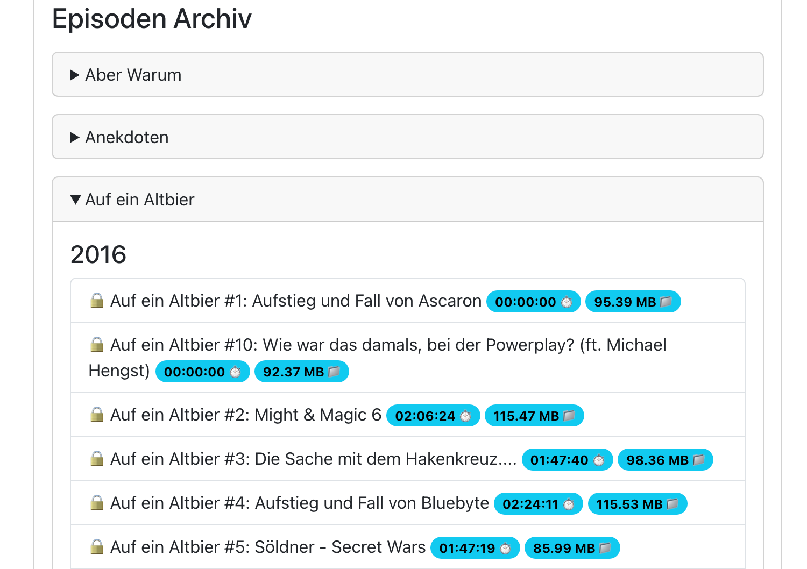

'Sunday Projects' sind die kleinen, technischen Projekte und Spielereien mit denen ich in unregelmäßigen Abständen meine
Zeit verbringe.

Diesmal mit einem Update zum Post des [RSS Analyzer](/sunday-projects-rss-analyzer) aus 2023.

Die Auswertungen sind hier zu finden: [https://rssanalyzer.org](https://rssanalyzer.org/mindestens10zeichen).


<!--truncate-->

Nennenswerte Upgrades:

1. Das Tool hat jetzt eine eigene [Domain](https://rssanalyzer.org)
2. Das Backend wurde in Java leserlicher und erweiterbarer neu geschrieben
3. Das Frontend ist jetzt optisch moderner und unterstuetzt mobile Endgeräte
4. Die Kategorieauswertung wird zusaetzlich in Form eines zweidimensionalen Balkendiagrams praesentiert

---

> Das neue UI
---

> Die Auflistung aller Episoden pro Kategorie und Jahr. Öffentliche Episoden sind ebenfalls direkt zur MP3 Datei
> verlinkt. Zusätzlich sind die Dateigröße, sowie die Episodendauer angegeben.
---

```java title="Main.java"
public static void main(String[] args) throws IOException {
    // Reads config file
    final Config config = yamlMapper.readValue(new File("src/main/resources/config.yaml"), Config.  
    try {
        // Iterate over RSS Feeds and compute serializable result record
        final Result result = computeResult(
            config, 
            new StaticCategoryMatcher(config)
    
        // Register Export Transformer
        new RssExporter(config).export(
                result,
                new JsonTransformer(),
                new CSVTransformer(),
                new YamlTransformer()
        );
    }
}
```

Wenn ihr weitere Idee oder Podcasts habt, die ich aufnehmen kann, meldet euch gerne bei mir oder auf unserem Discord!

Luca
