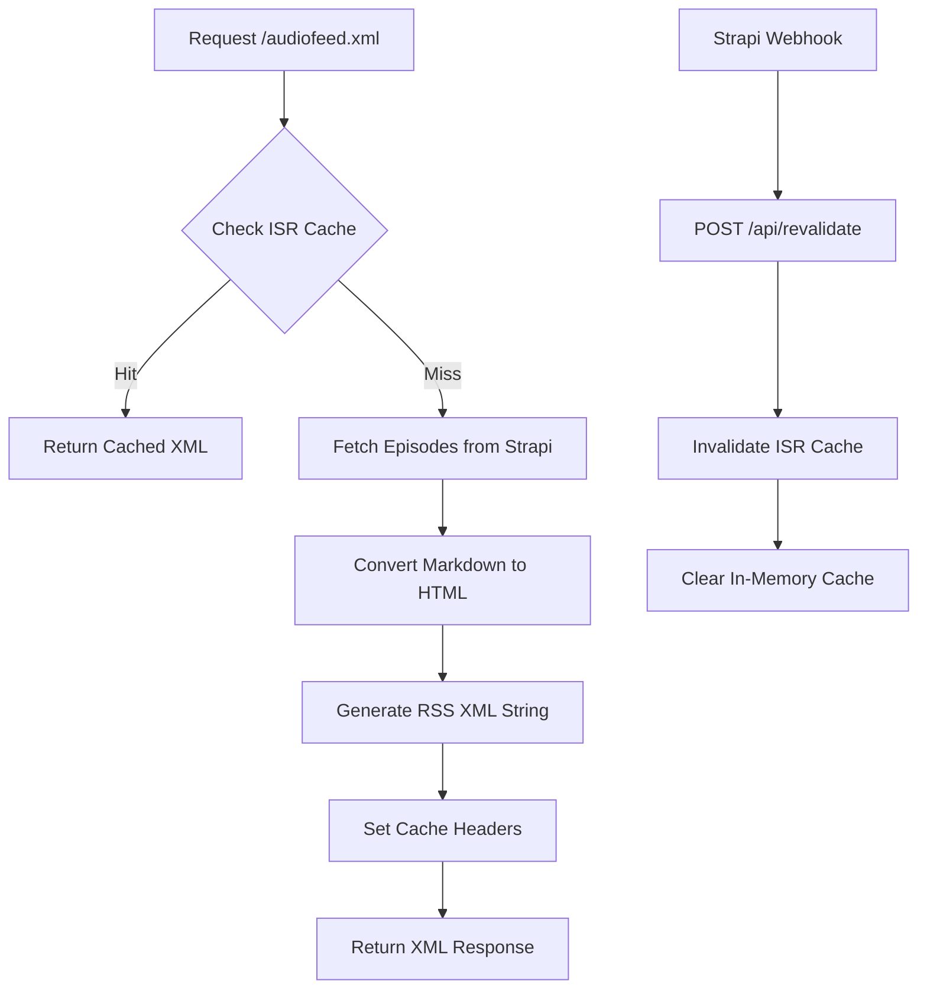
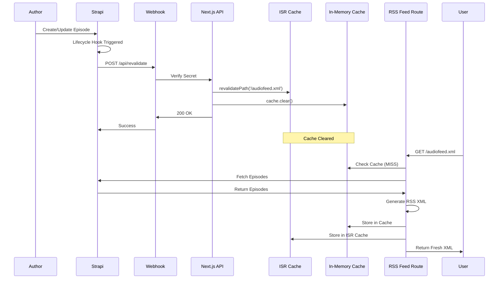

# Rss feed XML generation

_Exported on 12/17/2025 at 17:45:17 GMT+1 from Cursor (2.2.20)_

---

**User**

@.cursor/plans/strapi_next.js_migration_bf128495.plan.md

how do we technically generate the rss feed xml?

---

**Cursor**

Reviewing the existing RSS feed implementation to understand the format and data structure.

Checking markdown-to-HTML conversion and episode data structure:

Checking an episode file to understand the data structure:

Technical approach for generating the RSS feed XML in Next.js:

## Technical RSS Feed Generation Approach

### Current Implementation Analysis

The current system uses:

- `xml2js` to parse a template XML file, modify it, and rebuild XML
- Custom markdown-to-HTML conversion for episode descriptions
- File size caching via HTTP HEAD requests
- SHA256 hash of audio URL for GUID generation

### Next.js Implementation Strategy

For Next.js, there are two approaches:

**Option 1: Template Literal Approach (Recommended)**

- Build XML using template literals
- Simpler, no dependencies, better performance
- Easier to maintain and debug

**Option 2: XML Builder Library**

- Use a library like `xml2js` or `fast-xml-parser`
- More structured, but adds dependency

### Implementation Details

Here's how the RSS feed generation would work technically:

```typescript
// nextjs/app/audiofeed.xml/route.ts

import { NextRequest, NextResponse } from 'next/server';
import { getStrapiEpisodes } from '@/lib/strapi';
import { markdownToHtml } from '@/lib/markdown-to-html';
import { formatRSSDate, getSeconds } from '@/lib/rss-utils';

export const revalidate = 3600; // ISR: revalidate every hour

export async function GET(request: NextRequest) {
  try {
    // Fetch episodes from Strapi (only published, ordered by date DESC)
    const episodes = await getStrapiEpisodes();
    
    // Generate RSS XML
    const rssXml = generateRSSFeed(episodes);
    
    // Set cache headers
    const headers = new Headers();
    headers.set('Content-Type', 'application/rss+xml; charset=utf-8');
    headers.set('Cache-Control', 'public, max-age=3600, must-revalidate');
    
    // Set ETag based on latest episode timestamp
    if (episodes.length > 0) {
      const latestTimestamp = new Date(episodes[0].publishedAt).getTime();
      headers.set('ETag', `"${latestTimestamp}"`);
      headers.set('Last-Modified', new Date(episodes[0].publishedAt).toUTCString());
    }
    
    return new NextResponse(rssXml, { headers });
  } catch (error) {
    console.error('RSS feed generation error:', error);
    // Return error or fallback to cached version
    return new NextResponse('Error generating RSS feed', { status: 500 });
  }
}

function generateRSSFeed(episodes: Episode[]): string {
  const channelPubDate = formatRSSDate(new Date());
  
  // Build channel header (static metadata)
  const channelHeader = `<?xml version="1.0" encoding="UTF-8"?>
<rss version="2.0" xmlns:atom="http://www.w3.org/2005/Atom" xmlns:podcast="https://podcastindex.org/namespace/1.0" xmlns:itunes="http://www.itunes.com/dtds/podcast-1.0.dtd">
    <channel>
        <title>M10Z Podcasts</title>
        <link>https://m10z.de</link>
        <description>Die Podcasts von M10Z, dem offenen Kanal für Videospiele und das Drumherum</description>
        <ttl>60</ttl>
        <language>de</language>
        <copyright>All rights reserved</copyright>
        <webMaster>m10z@posteo.de</webMaster>
        <author>m10z@posteo.de</author>
        <itunes:category text="Leisure"/>
        <itunes:owner>
            <itunes:name>M10Z</itunes:name>
            <itunes:email>m10z@posteo.de</itunes:email>
        </itunes:owner>
        <itunes:author>M10Z</itunes:author>
        <itunes:explicit>false</itunes:explicit>
        <itunes:type>episodic</itunes:type>
        <itunes:image href="https://raw.githubusercontent.com/LucaNerlich/m10z/main/static/img/formate/cover/m10z.jpg"/>
        <image>
            <url>https://raw.githubusercontent.com/LucaNerlich/m10z/main/static/img/formate/cover/m10z.jpg</url>
            <title>M10Z Podcasts</title>
            <link>https://m10z.de</link>
        </image>
        <atom:link href="https://m10z.de/audiofeed.xml" rel="self" type="application/rss+xml"/>
        <podcast:guid>E9QfcR8TYeotS5ceJLmn</podcast:guid>
        <pubDate>${channelPubDate}</pubDate>`;

  // Generate episode items
  const items = episodes.map(episode => generateEpisodeItem(episode)).join('\n');
  
  // Close channel and RSS
  const channelFooter = `    </channel>
</rss>`;
  
  return `${channelHeader}\n${items}\n${channelFooter}`;
}

function generateEpisodeItem(episode: Episode): string {
  // Convert markdown description to HTML
  const descriptionHtml = markdownToHtml(episode.description || '');
  
  // Generate GUID (SHA256 hash of audio URL)
  const guid = generateGuid(episode.audioFile.url);
  
  // Format dates
  const pubDate = formatRSSDate(new Date(episode.publishedAt));
  
  // Convert duration to seconds
  const durationSeconds = episode.duration || getSeconds(episode.durationString);
  
  // Get file size (from Strapi metadata or cache)
  const fileSize = episode.audioFileSize || 0;
  
  // Get cover image URL
  const coverImage = episode.coverImage?.url || 
    'https://raw.githubusercontent.com/LucaNerlich/m10z/main/static/img/formate/cover/m10z.jpg';
  
  // Get blog post link
  const blogLink = episode.blogPost?.slug 
    ? `https://m10z.de/posts/${episode.blogPost.slug}`
    : 'https://m10z.de';
  
  // Escape XML special characters in title
  const title = escapeXml(episode.title);
  
  return `        <item>
            <title>${title}</title>
            <pubDate>${pubDate}</pubDate>
            <lastBuildDate>${pubDate}</lastBuildDate>
            <guid isPermaLink="false">${guid}</guid>
            <itunes:image href="${coverImage}"/>
            <description><![CDATA[${descriptionHtml}]]></description>
            <author>m10z@posteo.de</author>
            <itunes:explicit>false</itunes:explicit>
            <link>${blogLink}</link>
            <itunes:duration>${durationSeconds}</itunes:duration>
            <enclosure url="${episode.audioFile.url}" length="${fileSize}" type="audio/mpeg"/>
        </item>`;
}
```

### Supporting Utilities

```typescript
// nextjs/lib/rss-utils.ts

import crypto from 'crypto';

/**
 * Convert date to RFC 2822 format (required for RSS pubDate)
 */
export function formatRSSDate(date: Date): string {
  return date.toUTCString();
}

/**
 * Generate SHA256 hash for GUID (matches current implementation)
 */
export function generateGuid(url: string): string {
  return crypto.createHash('sha256').update(url).digest('hex');
}

/**
 * Convert time string to seconds (supports HH:MM:SS, MM:SS, or seconds)
 */
export function getSeconds(timeString: string): number {
  const parts = timeString.split(':');
  if (parts.length === 3) {
    return parseInt(parts[0]) * 3600 + parseInt(parts[1]) * 60 + parseInt(parts[2]);
  } else if (parts.length === 2) {
    return parseInt(parts[0]) * 60 + parseInt(parts[1]);
  }
  return parseInt(parts[0]);
}

/**
 * Escape XML special characters
 */
export function escapeXml(text: string): string {
  return text
    .replace(/&/g, '&amp;')
    .replace(/</g, '&lt;')
    .replace(/>/g, '&gt;')
    .replace(/"/g, '&quot;')
    .replace(/'/g, '&apos;');
}
```

### Markdown to HTML Conversion

You can either:

1. Port the existing `markdownToHtml.js` to TypeScript
2. Use a library like `marked` or `remark` (more robust, but adds dependency)

```typescript
// nextjs/lib/markdown-to-html.ts
// Port the existing markdownToHtml function from scripts/markdownToHtml.js
// OR use a library like 'marked'
```

### Strapi Data Fetching

```typescript
// nextjs/lib/strapi.ts

export interface Episode {
  id: number;
  title: string;
  slug: string;
  description: string; // RichText field
  publishedAt: string;
  duration: number; // seconds
  audioFile: {
    url: string;
    size?: number; // file size in bytes
  };
  coverImage?: {
    url: string;
  };
  blogPost?: {
    slug: string;
  };
}

export async function getStrapiEpisodes(): Promise<Episode[]> {
  const response = await fetch(
    `${process.env.STRAPI_API_URL}/api/audio-episodes?` +
    `publicationState=live&` +
    `sort=publishedAt:desc&` +
    `populate[audioFile][fields][0]=url&` +
    `populate[audioFile][fields][1]=size&` +
    `populate[coverImage][fields][0]=url&` +
    `populate[blogPost][fields][0]=slug`,
    {
      headers: {
        'Authorization': `Bearer ${process.env.STRAPI_API_TOKEN}`,
      },
      next: { revalidate: 3600 }, // Cache for 1 hour
    }
  );
  
  if (!response.ok) {
    throw new Error('Failed to fetch episodes from Strapi');
  }
  
  const data = await response.json();
  return data.data.map((item: any) => ({
    id: item.id,
    title: item.attributes.title,
    slug: item.attributes.slug,
    description: item.attributes.description, // RichText - needs conversion
    publishedAt: item.attributes.publishedAt,
    duration: item.attributes.duration,
    audioFile: {
      url: item.attributes.audioFile?.data?.attributes?.url,
      size: item.attributes.audioFile?.data?.attributes?.size,
    },
    coverImage: item.attributes.coverImage?.data?.attributes?.url ? {
      url: item.attributes.coverImage.data.attributes.url,
    } : undefined,
    blogPost: item.attributes.blogPost?.data?.attributes?.slug ? {
      slug: item.attributes.blogPost.data.attributes.slug,
    } : undefined,
  }));
}
```

### Key Technical Considerations

1. XML escaping: Escape `&`, `<`, `>`, `"`, `'` in text content
2. CDATA sections: Wrap HTML descriptions in `<![CDATA[...]]>` to avoid XML parsing issues
3. Date formatting: Use RFC 2822 format (`toUTCString()`) for `pubDate`
4. File size: Store in Strapi media metadata or fetch on-demand (with caching)
5. GUID generation: Use SHA256 hash of audio URL (matches current implementation)
6. Markdown conversion: Port existing logic or use a library
7. Performance: Use ISR caching + in-memory cache fallback
8. Error handling: Return 500 or serve stale cache if Strapi is unavailable

### Data Flow Diagram



This approach:

- Generates XML using template literals (no XML parsing overhead)
- Maintains compatibility with the current RSS format
- Leverages Next.js ISR for caching
- Handles markdown conversion and XML escaping properly
- Supports webhook-based cache invalidation

Should I add this technical implementation to the plan, or do you want to adjust anything first?

```typescript
// nextjs/app/audiofeed.xml/route.ts

import { NextRequest, NextResponse } from 'next/server';
import { getStrapiEpisodes } from '@/lib/strapi';
import { markdownToHtml } from '@/lib/markdown-to-html';
import { formatRSSDate, getSeconds } from '@/lib/rss-utils';

export const revalidate = 3600; // ISR: revalidate every hour

export async function GET(request: NextRequest) {
  try {
    // Fetch episodes from Strapi (only published, ordered by date DESC)
    const episodes = await getStrapiEpisodes();
    
    // Generate RSS XML
    const rssXml = generateRSSFeed(episodes);
    
    // Set cache headers
    const headers = new Headers();
    headers.set('Content-Type', 'application/rss+xml; charset=utf-8');
    headers.set('Cache-Control', 'public, max-age=3600, must-revalidate');
    
    // Set ETag based on latest episode timestamp
    if (episodes.length > 0) {
      const latestTimestamp = new Date(episodes[0].publishedAt).getTime();
      headers.set('ETag', `"${latestTimestamp}"`);
      headers.set('Last-Modified', new Date(episodes[0].publishedAt).toUTCString());
    }
    
    return new NextResponse(rssXml, { headers });
  } catch (error) {
    console.error('RSS feed generation error:', error);
    // Return error or fallback to cached version
    return new NextResponse('Error generating RSS feed', { status: 500 });
  }
}

function generateRSSFeed(episodes: Episode[]): string {
  const channelPubDate = formatRSSDate(new Date());
  
  // Build channel header (static metadata)
  const channelHeader = `<?xml version="1.0" encoding="UTF-8"?>
<rss version="2.0" xmlns:atom="http://www.w3.org/2005/Atom" xmlns:podcast="https://podcastindex.org/namespace/1.0" xmlns:itunes="http://www.itunes.com/dtds/podcast-1.0.dtd">
    <channel>
        <title>M10Z Podcasts</title>
        <link>https://m10z.de</link>
        <description>Die Podcasts von M10Z, dem offenen Kanal für Videospiele und das Drumherum</description>
        <ttl>60</ttl>
        <language>de</language>
        <copyright>All rights reserved</copyright>
        <webMaster>m10z@posteo.de</webMaster>
        <author>m10z@posteo.de</author>
        <itunes:category text="Leisure"/>
        <itunes:owner>
            <itunes:name>M10Z</itunes:name>
            <itunes:email>m10z@posteo.de</itunes:email>
        </itunes:owner>
        <itunes:author>M10Z</itunes:author>
        <itunes:explicit>false</itunes:explicit>
        <itunes:type>episodic</itunes:type>
        <itunes:image href="https://raw.githubusercontent.com/LucaNerlich/m10z/main/static/img/formate/cover/m10z.jpg"/>
        <image>
            <url>https://raw.githubusercontent.com/LucaNerlich/m10z/main/static/img/formate/cover/m10z.jpg</url>
            <title>M10Z Podcasts</title>
            <link>https://m10z.de</link>
        </image>
        <atom:link href="https://m10z.de/audiofeed.xml" rel="self" type="application/rss+xml"/>
        <podcast:guid>E9QfcR8TYeotS5ceJLmn</podcast:guid>
        <pubDate>${channelPubDate}</pubDate>`;

  // Generate episode items
  const items = episodes.map(episode => generateEpisodeItem(episode)).join('\n');
  
  // Close channel and RSS
  const channelFooter = `    </channel>
</rss>`;
  
  return `${channelHeader}\n${items}\n${channelFooter}`;
}

function generateEpisodeItem(episode: Episode): string {
  // Convert markdown description to HTML
  const descriptionHtml = markdownToHtml(episode.description || '');
  
  // Generate GUID (SHA256 hash of audio URL)
  const guid = generateGuid(episode.audioFile.url);
  
  // Format dates
  const pubDate = formatRSSDate(new Date(episode.publishedAt));
  
  // Convert duration to seconds
  const durationSeconds = episode.duration || getSeconds(episode.durationString);
  
  // Get file size (from Strapi metadata or cache)
  const fileSize = episode.audioFileSize || 0;
  
  // Get cover image URL
  const coverImage = episode.coverImage?.url || 
    'https://raw.githubusercontent.com/LucaNerlich/m10z/main/static/img/formate/cover/m10z.jpg';
  
  // Get blog post link
  const blogLink = episode.blogPost?.slug 
    ? `https://m10z.de/posts/${episode.blogPost.slug}`
    : 'https://m10z.de';
  
  // Escape XML special characters in title
  const title = escapeXml(episode.title);
  
  return `        <item>
            <title>${title}</title>
            <pubDate>${pubDate}</pubDate>
            <lastBuildDate>${pubDate}</lastBuildDate>
            <guid isPermaLink="false">${guid}</guid>
            <itunes:image href="${coverImage}"/>
            <description><![CDATA[${descriptionHtml}]]></description>
            <author>m10z@posteo.de</author>
            <itunes:explicit>false</itunes:explicit>
            <link>${blogLink}</link>
            <itunes:duration>${durationSeconds}</itunes:duration>
            <enclosure url="${episode.audioFile.url}" length="${fileSize}" type="audio/mpeg"/>
        </item>`;
}
```

```typescript
// nextjs/lib/rss-utils.ts

import crypto from 'crypto';

/**
 * Convert date to RFC 2822 format (required for RSS pubDate)
 */
export function formatRSSDate(date: Date): string {
  return date.toUTCString();
}

/**
 * Generate SHA256 hash for GUID (matches current implementation)
 */
export function generateGuid(url: string): string {
  return crypto.createHash('sha256').update(url).digest('hex');
}

/**
 * Convert time string to seconds (supports HH:MM:SS, MM:SS, or seconds)
 */
export function getSeconds(timeString: string): number {
  const parts = timeString.split(':');
  if (parts.length === 3) {
    return parseInt(parts[0]) * 3600 + parseInt(parts[1]) * 60 + parseInt(parts[2]);
  } else if (parts.length === 2) {
    return parseInt(parts[0]) * 60 + parseInt(parts[1]);
  }
  return parseInt(parts[0]);
}

/**
 * Escape XML special characters
 */
export function escapeXml(text: string): string {
  return text
    .replace(/&/g, '&amp;')
    .replace(/</g, '&lt;')
    .replace(/>/g, '&gt;')
    .replace(/"/g, '&quot;')
    .replace(/'/g, '&apos;');
}
```

```typescript
// nextjs/lib/markdown-to-html.ts
// Port the existing markdownToHtml function from scripts/markdownToHtml.js
// OR use a library like 'marked'
```

```typescript
// nextjs/lib/strapi.ts

export interface Episode {
  id: number;
  title: string;
  slug: string;
  description: string; // RichText field
  publishedAt: string;
  duration: number; // seconds
  audioFile: {
    url: string;
    size?: number; // file size in bytes
  };
  coverImage?: {
    url: string;
  };
  blogPost?: {
    slug: string;
  };
}

export async function getStrapiEpisodes(): Promise<Episode[]> {
  const response = await fetch(
    `${process.env.STRAPI_API_URL}/api/audio-episodes?` +
    `publicationState=live&` +
    `sort=publishedAt:desc&` +
    `populate[audioFile][fields][0]=url&` +
    `populate[audioFile][fields][1]=size&` +
    `populate[coverImage][fields][0]=url&` +
    `populate[blogPost][fields][0]=slug`,
    {
      headers: {
        'Authorization': `Bearer ${process.env.STRAPI_API_TOKEN}`,
      },
      next: { revalidate: 3600 }, // Cache for 1 hour
    }
  );
  
  if (!response.ok) {
    throw new Error('Failed to fetch episodes from Strapi');
  }
  
  const data = await response.json();
  return data.data.map((item: any) => ({
    id: item.id,
    title: item.attributes.title,
    slug: item.attributes.slug,
    description: item.attributes.description, // RichText - needs conversion
    publishedAt: item.attributes.publishedAt,
    duration: item.attributes.duration,
    audioFile: {
      url: item.attributes.audioFile?.data?.attributes?.url,
      size: item.attributes.audioFile?.data?.attributes?.size,
    },
    coverImage: item.attributes.coverImage?.data?.attributes?.url ? {
      url: item.attributes.coverImage.data.attributes.url,
    } : undefined,
    blogPost: item.attributes.blogPost?.data?.attributes?.slug ? {
      slug: item.attributes.blogPost.data.attributes.slug,
    } : undefined,
  }));
}
```

```plaintext
flowchart TD
    A[Request /audiofeed.xml] --> B{Check ISR Cache}
    B -->|Hit| C[Return Cached XML]
    B -->|Miss| D[Fetch Episodes from Strapi]
    D --> E[Convert Markdown to HTML]
    E --> F[Generate RSS XML String]
    F --> G[Set Cache Headers]
    G --> H[Return XML Response]
    
    I[Strapi Webhook] --> J[POST /api/revalidate]
    J --> K[Invalidate ISR Cache]
    K --> L[Clear In-Memory Cache]
```

---

**User**

how do we "clear" our cache on podcast changes in our backend?

---

**Cursor**

Explaining how to clear the cache when podcast changes occur in Strapi. Reviewing the plan and outlining the cache
invalidation mechanism:

Cache invalidation when podcast changes occur in Strapi:

## Cache Invalidation Architecture

Two mechanisms clear the cache:

### 1. Strapi Webhook Configuration

Configure Strapi to send webhooks when episodes are created or updated:

**In Strapi Admin Panel:**

- Settings → Webhooks → Create Webhook
- Events: `entry.create`, `entry.update` (filtered to `audio-episode` content type)
- URL: `https://m10z.de/api/revalidate`
- Method: POST
- Headers: Include authentication secret

**Alternative: Programmatic Webhook Setup**

You can also configure webhooks programmatically in Strapi:

```javascript
// strapi/config/webhooks.js (if using config file)
// OR configure via Strapi Admin UI

// Strapi webhooks are typically configured via Admin UI
// But you can also use lifecycle hooks to trigger webhooks
```

**Using Strapi Lifecycle Hooks (More Control):**

```javascript
// strapi/src/api/audio-episode/content-types/audio-episode/lifecycles.js

module.exports = {
  async afterCreate(event) {
    const { result } = event;
    // Trigger cache invalidation
    await invalidateCache(result);
  },
  
  async afterUpdate(event) {
    const { result } = event;
    // Only invalidate if published
    if (result.publishedAt) {
      await invalidateCache(result);
    }
  },
  
  async afterDelete(event) {
    // Invalidate cache when episode is deleted
    await invalidateCache(null);
  },
};

async function invalidateCache(episode) {
  const webhookSecret = process.env.WEBHOOK_SECRET;
  const nextjsUrl = process.env.NEXTJS_URL || 'https://m10z.de';
  
  try {
    // Call Next.js revalidation endpoint
    await fetch(`${nextjsUrl}/api/revalidate`, {
      method: 'POST',
      headers: {
        'Content-Type': 'application/json',
        'Authorization': `Bearer ${webhookSecret}`,
      },
      body: JSON.stringify({
        path: '/audiofeed.xml',
        secret: webhookSecret,
      }),
    });
  } catch (error) {
    console.error('Failed to invalidate cache:', error);
    // Log but don't throw - webhook failure shouldn't break Strapi
  }
}
```

### 2. Next.js Revalidation API Endpoint

Create an API route that handles cache invalidation:

```typescript
// nextjs/app/api/revalidate/route.ts

import { NextRequest, NextResponse } from 'next/server';
import { revalidatePath } from 'next/cache';

// In-memory cache store (if using Layer 3 caching)
const rssCache = new Map<string, { xml: string; timestamp: number }>();

export async function POST(request: NextRequest) {
  try {
    // 1. Verify webhook secret
    const authHeader = request.headers.get('authorization');
    const body = await request.json();
    const secret = body.secret || request.nextUrl.searchParams.get('secret');
    const expectedSecret = process.env.WEBHOOK_SECRET;
    
    // Verify secret from header or body
    const providedSecret = authHeader?.replace('Bearer ', '') || secret;
    
    if (!expectedSecret || providedSecret !== expectedSecret) {
      return NextResponse.json(
        { error: 'Unauthorized' },
        { status: 401 }
      );
    }
    
    // 2. Get path to revalidate
    const path = body.path || request.nextUrl.searchParams.get('path') || '/audiofeed.xml';
    
    // 3. Invalidate Next.js ISR cache
    revalidatePath(path);
    
    // 4. Clear in-memory cache (if using Layer 3)
    rssCache.clear();
    
    // 5. Log the invalidation
    console.log(`Cache invalidated for path: ${path} at ${new Date().toISOString()}`);
    
    return NextResponse.json({
      revalidated: true,
      path,
      timestamp: Date.now(),
    });
    
  } catch (error) {
    console.error('Revalidation error:', error);
    return NextResponse.json(
      { error: 'Failed to revalidate cache' },
      { status: 500 }
    );
  }
}
```

### 3. Updated RSS Feed Route with In-Memory Cache

Here's how the RSS feed route would work with cache clearing:

```typescript
// nextjs/app/audiofeed.xml/route.ts

import { NextRequest, NextResponse } from 'next/server';
import { getStrapiEpisodes } from '@/lib/strapi';
import { generateRSSFeed } from '@/lib/rss-generator';

export const revalidate = 3600; // ISR: revalidate every hour

// In-memory cache (shared with revalidate endpoint)
// In production, consider using Redis or similar
export const rssCache = new Map<string, { xml: string; timestamp: number }>();

export async function GET(request: NextRequest) {
  try {
    // Check in-memory cache first (Layer 3)
    const cacheKey = 'audiofeed';
    const cached = rssCache.get(cacheKey);
    
    if (cached) {
      const age = Date.now() - cached.timestamp;
      const maxAge = 3600 * 1000; // 1 hour
      
      if (age < maxAge) {
        // Cache hit - return cached XML
        const headers = new Headers();
        headers.set('Content-Type', 'application/rss+xml; charset=utf-8');
        headers.set('X-Cache', 'HIT-MEMORY');
        return new NextResponse(cached.xml, { headers });
      } else {
        // Cache expired - remove it
        rssCache.delete(cacheKey);
      }
    }
    
    // Cache miss - fetch from Strapi and generate
    const episodes = await getStrapiEpisodes();
    const rssXml = generateRSSFeed(episodes);
    
    // Store in in-memory cache
    rssCache.set(cacheKey, {
      xml: rssXml,
      timestamp: Date.now(),
    });
    
    // Set cache headers
    const headers = new Headers();
    headers.set('Content-Type', 'application/rss+xml; charset=utf-8');
    headers.set('Cache-Control', 'public, max-age=3600, must-revalidate');
    headers.set('X-Cache', 'MISS');
    
    if (episodes.length > 0) {
      const latestTimestamp = new Date(episodes[0].publishedAt).getTime();
      headers.set('ETag', `"${latestTimestamp}"`);
      headers.set('Last-Modified', new Date(episodes[0].publishedAt).toUTCString());
    }
    
    return new NextResponse(rssXml, { headers });
    
  } catch (error) {
    console.error('RSS feed generation error:', error);
    
    // Try to serve stale cache if available
    const cached = rssCache.get('audiofeed');
    if (cached) {
      const headers = new Headers();
      headers.set('Content-Type', 'application/rss+xml; charset=utf-8');
      headers.set('X-Cache', 'STALE');
      return new NextResponse(cached.xml, { headers });
    }
    
    return new NextResponse('Error generating RSS feed', { status: 500 });
  }
}
```

### 4. Cache Clearing Flow Diagram



### 5. Security Considerations

**Webhook Secret Verification:**

- Always verify the secret before clearing cache
- Use environment variables for secrets
- Consider rate limiting the revalidation endpoint
- Log all invalidation attempts for monitoring

**Rate Limiting Example:**

```typescript
// nextjs/lib/rate-limit.ts
import { LRUCache } from 'lru-cache';

const rateLimit = new LRUCache<string, number>({
  max: 100,
  ttl: 60000, // 1 minute
});

export function checkRateLimit(ip: string): boolean {
  const count = rateLimit.get(ip) || 0;
  if (count >= 10) { // Max 10 requests per minute
    return false;
  }
  rateLimit.set(ip, count + 1);
  return true;
}
```

### 6. Alternative: Using Next.js `revalidateTag` (App Router)

If you want more granular control, you can use `revalidateTag`:

```typescript
// In RSS feed route
import { unstable_cache } from 'next/cache';

const getCachedEpisodes = unstable_cache(
  async () => getStrapiEpisodes(),
  ['audio-episodes'],
  { tags: ['rss-feed'], revalidate: 3600 }
);

// In revalidate endpoint
import { revalidateTag } from 'next/cache';

revalidateTag('rss-feed'); // This clears the cache
```

### Summary

Cache clearing happens through:

1. Strapi lifecycle hooks → trigger on episode create/update/delete
2. Webhook call → POST to `/api/revalidate` with secret
3. Next.js revalidation → `revalidatePath()` clears ISR cache
4. In-memory cache → cleared programmatically
5. Next request → regenerates fresh RSS feed

This ensures new episodes appear in the RSS feed within seconds of publishing, while maintaining performance through
caching.

Should I add these implementation details to the plan, or do you want to adjust anything first?

```javascript
// strapi/config/webhooks.js (if using config file)
// OR configure via Strapi Admin UI

// Strapi webhooks are typically configured via Admin UI
// But you can also use lifecycle hooks to trigger webhooks
```

```javascript
// strapi/src/api/audio-episode/content-types/audio-episode/lifecycles.js

module.exports = {
  async afterCreate(event) {
    const { result } = event;
    // Trigger cache invalidation
    await invalidateCache(result);
  },
  
  async afterUpdate(event) {
    const { result } = event;
    // Only invalidate if published
    if (result.publishedAt) {
      await invalidateCache(result);
    }
  },
  
  async afterDelete(event) {
    // Invalidate cache when episode is deleted
    await invalidateCache(null);
  },
};

async function invalidateCache(episode) {
  const webhookSecret = process.env.WEBHOOK_SECRET;
  const nextjsUrl = process.env.NEXTJS_URL || 'https://m10z.de';
  
  try {
    // Call Next.js revalidation endpoint
    await fetch(`${nextjsUrl}/api/revalidate`, {
      method: 'POST',
      headers: {
        'Content-Type': 'application/json',
        'Authorization': `Bearer ${webhookSecret}`,
      },
      body: JSON.stringify({
        path: '/audiofeed.xml',
        secret: webhookSecret,
      }),
    });
  } catch (error) {
    console.error('Failed to invalidate cache:', error);
    // Log but don't throw - webhook failure shouldn't break Strapi
  }
}
```

```typescript
// nextjs/app/api/revalidate/route.ts

import { NextRequest, NextResponse } from 'next/server';
import { revalidatePath } from 'next/cache';

// In-memory cache store (if using Layer 3 caching)
const rssCache = new Map<string, { xml: string; timestamp: number }>();

export async function POST(request: NextRequest) {
  try {
    // 1. Verify webhook secret
    const authHeader = request.headers.get('authorization');
    const body = await request.json();
    const secret = body.secret || request.nextUrl.searchParams.get('secret');
    const expectedSecret = process.env.WEBHOOK_SECRET;
    
    // Verify secret from header or body
    const providedSecret = authHeader?.replace('Bearer ', '') || secret;
    
    if (!expectedSecret || providedSecret !== expectedSecret) {
      return NextResponse.json(
        { error: 'Unauthorized' },
        { status: 401 }
      );
    }
    
    // 2. Get path to revalidate
    const path = body.path || request.nextUrl.searchParams.get('path') || '/audiofeed.xml';
    
    // 3. Invalidate Next.js ISR cache
    revalidatePath(path);
    
    // 4. Clear in-memory cache (if using Layer 3)
    rssCache.clear();
    
    // 5. Log the invalidation
    console.log(`Cache invalidated for path: ${path} at ${new Date().toISOString()}`);
    
    return NextResponse.json({
      revalidated: true,
      path,
      timestamp: Date.now(),
    });
    
  } catch (error) {
    console.error('Revalidation error:', error);
    return NextResponse.json(
      { error: 'Failed to revalidate cache' },
      { status: 500 }
    );
  }
}
```

```typescript
// nextjs/app/audiofeed.xml/route.ts

import { NextRequest, NextResponse } from 'next/server';
import { getStrapiEpisodes } from '@/lib/strapi';
import { generateRSSFeed } from '@/lib/rss-generator';

export const revalidate = 3600; // ISR: revalidate every hour

// In-memory cache (shared with revalidate endpoint)
// In production, consider using Redis or similar
export const rssCache = new Map<string, { xml: string; timestamp: number }>();

export async function GET(request: NextRequest) {
  try {
    // Check in-memory cache first (Layer 3)
    const cacheKey = 'audiofeed';
    const cached = rssCache.get(cacheKey);
    
    if (cached) {
      const age = Date.now() - cached.timestamp;
      const maxAge = 3600 * 1000; // 1 hour
      
      if (age < maxAge) {
        // Cache hit - return cached XML
        const headers = new Headers();
        headers.set('Content-Type', 'application/rss+xml; charset=utf-8');
        headers.set('X-Cache', 'HIT-MEMORY');
        return new NextResponse(cached.xml, { headers });
      } else {
        // Cache expired - remove it
        rssCache.delete(cacheKey);
      }
    }
    
    // Cache miss - fetch from Strapi and generate
    const episodes = await getStrapiEpisodes();
    const rssXml = generateRSSFeed(episodes);
    
    // Store in in-memory cache
    rssCache.set(cacheKey, {
      xml: rssXml,
      timestamp: Date.now(),
    });
    
    // Set cache headers
    const headers = new Headers();
    headers.set('Content-Type', 'application/rss+xml; charset=utf-8');
    headers.set('Cache-Control', 'public, max-age=3600, must-revalidate');
    headers.set('X-Cache', 'MISS');
    
    if (episodes.length > 0) {
      const latestTimestamp = new Date(episodes[0].publishedAt).getTime();
      headers.set('ETag', `"${latestTimestamp}"`);
      headers.set('Last-Modified', new Date(episodes[0].publishedAt).toUTCString());
    }
    
    return new NextResponse(rssXml, { headers });
    
  } catch (error) {
    console.error('RSS feed generation error:', error);
    
    // Try to serve stale cache if available
    const cached = rssCache.get('audiofeed');
    if (cached) {
      const headers = new Headers();
      headers.set('Content-Type', 'application/rss+xml; charset=utf-8');
      headers.set('X-Cache', 'STALE');
      return new NextResponse(cached.xml, { headers });
    }
    
    return new NextResponse('Error generating RSS feed', { status: 500 });
  }
}
```

```plaintext
sequenceDiagram
    participant Author
    participant Strapi
    participant Webhook
    participant NextJS as Next.js API
    participant ISRCache as ISR Cache
    participant MemoryCache as In-Memory Cache
    participant RSSFeed as RSS Feed Route

    Author->>Strapi: Create/Update Episode
    Strapi->>Strapi: Lifecycle Hook Triggered
    Strapi->>Webhook: POST /api/revalidate
    Webhook->>NextJS: Verify Secret
    NextJS->>ISRCache: revalidatePath('/audiofeed.xml')
    NextJS->>MemoryCache: cache.clear()
    NextJS->>Webhook: 200 OK
    Webhook->>Strapi: Success
    
    Note over ISRCache,MemoryCache: Cache Cleared
    
    User->>RSSFeed: GET /audiofeed.xml
    RSSFeed->>MemoryCache: Check Cache (MISS)
    RSSFeed->>Strapi: Fetch Episodes
    Strapi->>RSSFeed: Return Episodes
    RSSFeed->>RSSFeed: Generate RSS XML
    RSSFeed->>MemoryCache: Store in Cache
    RSSFeed->>ISRCache: Store in ISR Cache
    RSSFeed->>User: Return Fresh XML
```

```typescript
// nextjs/lib/rate-limit.ts
import { LRUCache } from 'lru-cache';

const rateLimit = new LRUCache<string, number>({
  max: 100,
  ttl: 60000, // 1 minute
});

export function checkRateLimit(ip: string): boolean {
  const count = rateLimit.get(ip) || 0;
  if (count >= 10) { // Max 10 requests per minute
    return false;
  }
  rateLimit.set(ip, count + 1);
  return true;
}
```

```typescript
// In RSS feed route
import { unstable_cache } from 'next/cache';

const getCachedEpisodes = unstable_cache(
  async () => getStrapiEpisodes(),
  ['audio-episodes'],
  { tags: ['rss-feed'], revalidate: 3600 }
);

// In revalidate endpoint
import { revalidateTag } from 'next/cache';

revalidateTag('rss-feed'); // This clears the cache
```

